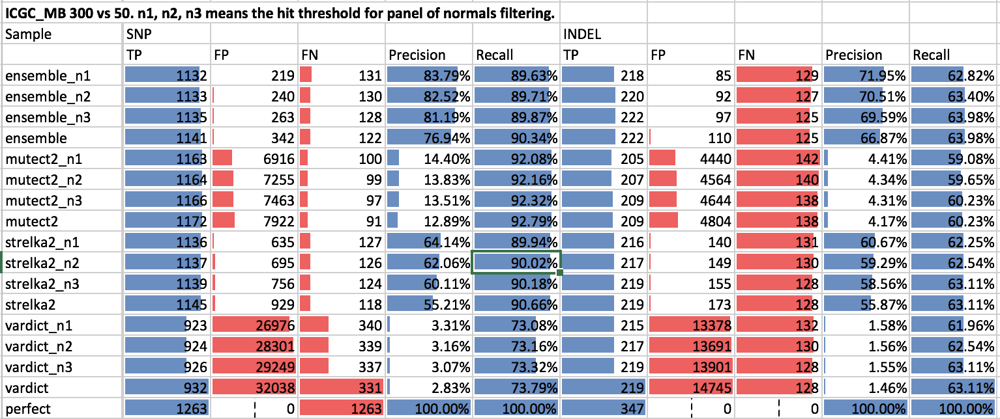

VCF Stuff
---------
📊Evaluating, filtering, comparing, and visualising genomic variants

[](https://travis-ci.org/umccr/vcf_stuff)


## Installation

```
conda install -c vladsaveliev -conda-forge -c bioconda vcf_utils
```

If conda is not installed on your computer, preliminary run before the above:

```
wget https://repo.continuum.io/miniconda/Miniconda3-latest-Linux-x86_64.sh -O miniconda.sh   # Linux
# wget https://repo.continuum.io/miniconda/Miniconda3-latest-MacOSX-x86_64.sh -O miniconda.sh  # macOS
bash miniconda.sh -b -p ./miniconda && rm miniconda.sh
. miniconda/etc/profile.d/conda.sh
```

## Development

Clone source and install on top of conda:

```
git clone https://github.com/umccr/vcf_stuff
cd vcf_stuff
pip install -e .
```

If you want to explore Jupyter notebooks, install additionally:

```
conda install -y jupyter matplotlib matplotlib-venn
```

## Testing
```
nosetests -s tests/test.py
```

## Variant calling evaluataion

Evaluate accuracy of somatic variant calling against a truth set VCF:

```
cd tests
eval_vcf data/test-benchmark.vcf.gz data/test-ensemble.vcf.gz data/test-vardict.vcf.gz -g data/test-GRCh37.fa -o results_eval_vcf
```

The tool normalizes all input VCFs (see `norm_vcf` below), and compares `test-ensemble.vcf.gz` and `test-vardict.vcf.gz` against the reference VCF `test-benchmark.vcf.gz`. Outputs statistics to stdout:

```
       Sample  SNP                         INDEL                      
               TP FP FN    Prec  Recall    TP FP FN    Prec  Recall
test-ensemble   1  0  0 100.00% 100.00%     0  0  0   0.00%   0.00%
 test-vardict   1  5  0  16.67% 100.00%     0  0  0   0.00%   0.00%
        Truth   1  0  1 100.00% 100.00%     0  0  0 100.00% 100.00%
```

Also saves intermediate data from `bcftools isec` into `results_eval_vcf/eval/{sample}_bcftools_isec/` for futher analysis, e.g. plotting in Jupyter.

```
eval/test-ensemble_bcftools_isec/0000.vcf	# FP (records private to test-ensemble.vcf.gz)
eval/test-ensemble_bcftools_isec/0001.vcf	# FN (records private to test-benchmark.vcf.gz)
eval/test-ensemble_bcftools_isec/0002.vcf	# TP (records from test-ensemble.vcf.gz shared by both)
eval/test-ensemble_bcftools_isec/0003.vcf	# TP (records from test-benchmark.vcf.gz shared by both)
```

Optionally, a BED file can be specified with `-r`:

```
eval_vcf benchmark.vcf sample.vcf -g GRCh37.fa -r callable_regions.bed
```

If provided, evaluation area will be restricted to those regions.

On Spartan and Raijin, instead of feeding the truth VCF directly, one can use presets (see https://github.com/umccr/hpc_utils). Same applies to the reference fasta - one can provide the genome build name instead of the full path to .fa file.

```
eval_vcf mb data/test-ensemble.vcf.gz data/test-vardict.vcf.gz -g GRCh37 -o results_eval_vcf
```

This will pick up the reference VCF from the [ICGC medulloblastoma study](https://www.nature.com/articles/ncomms10001) (somatic T/N).
Available truth sets preset options: `mb`, `colo` ([COLO829 metastatic melanoma cell line](https://www.ncbi.nlm.nih.gov/pmc/articles/PMC4837349)), `giab` (GiaB NA12878 germline variants), `dream` (DREAM synthetic challenge 3). For the latter 2, also truth regions BED files used, which are merged automatically with `-r` regions if those are provided.

`regions` and `truth_regions` are the optional fields for the validation target BED files. The BED files, if any provided, will be merged together and used to subset the variants in both truth and query variant sets.


## CNV evaluation

Similar to the VCF evaluation, you can compare CNV calls to the truth sets. The following callers are supported:

- cnvkit
- facets
- purple
- manta

The following truth sets are supported:

- HCC2218 exome
- COLO829 WGS (Hartwig's)
- COLO820 WGS ([Craig's study](https://www.nature.com/articles/ncomms10001))

Usage: 

```
eval_cnv -g GRCh37 -o results_eval_cnv \
    data/cnv/hcc2218/HCC2218_truthset_cnv_bcbio.tsv \
    data/cnv/hcc2218/HCC2218_cnvkit-call.cns purple.cnv.tsv \
    data/cnv/hcc2218/HCC2218_purple.cnv.tsv \
    data/cnv/hcc2218/HCC2218_facets_cncf.tsv
```

The tool produces 3 tables with standard performance statistics (true/false positive, false negatic, recall and precision rates):

```
Gene level comparison
                Sample    TP    FP    FN  Recall   Prec
0  HCC2218_cnvkit-call  6399  2631    13  99.80% 70.86%
1  HCC2218_facets_cncf  6399  5280    13  99.80% 54.79%
2        HCC2218_manta   606    89  5806   9.45% 87.19%
3   HCC2218_purple.cnv  4602  5924  1810  71.77% 43.72%

Event level comparison (Amp, Del)
                Sample    TP    FP    FN  Recall   Prec
0  HCC2218_cnvkit-call  6396  2638    20  99.69% 70.80%
1  HCC2218_facets_cncf  6398  5289    18  99.72% 54.74%
2        HCC2218_manta   317   378  6099   4.94% 45.61%
3   HCC2218_purple.cnv  4022  6508  2394  62.69% 38.20%

CN level comparison
                Sample    TP    FP    FN  Recall   Prec
0  HCC2218_cnvkit-call  5950  3125   494  92.33% 65.56%
1  HCC2218_facets_cncf  5821  5876   623  90.33% 49.76%
2        HCC2218_manta     0   695  6444   0.00%  0.00%
3   HCC2218_purple.cnv  3111  7423  3333  48.28% 29.53%
```

Each table represents the different level of comparison:

- `Gene level comparison` compares the sets of gene in which any event is occured. E.g. the truth set has a deletion in EGFR, and the sample has also any other event in EGFR (e.g. an amplification), it will count as a true positive.

- `Event level comparison (Amp, Del)` also requires the types of events per gene to be the same. It supports 2 types of events: Amp and Del. `DUP` for certain callers is authomatically translated into `Amp`, and `DEL` into `Del`. Callers that do not report event types but report CN values, CN>2 translates into `Amp`, CN<2 translates into `Del`, and CN=2 is ignored (we don't support copy-neutral LOHs).

- `CN level comparison` requires also the integer copy number estimation values to be the same. Only generated for callers and truth sets that contain CN values. For example, for WGS COLO829, it would looks like the following:

```
Gene level comparison
Sample                     TP    FP    FN  Recall  Prec
COLO_TGEN_bwa-cnvkit-call  6716  4680  6   99.91%  58.93%

Event level comparison (Amp, Del)
Sample                     TP    FP    FN  Recall  Prec
COLO_TGEN_bwa-cnvkit-call  6714  4700  8   99.88%  58.82%
```

In addition to that overall stats table, the tool will produce a per-gene table for details exploration, like the following:

```
                 truth         HCC2218_cnvkit-call  HCC2218_facets_cncf  HCC2218_manta  HCC2218_purple.cnv
1  AADACL3       Del:1         Del:1                Del:1                               Del:1
1  AADACL4       Del:1         Del:1                Del:1                               Del:1
1  ABCB10        Amp:6         Amp:6                Amp:6                               Amp:4
1  ABL2          Amp:3         Amp:3                Amp:3
1  AC004824.2    Del:1         Del:1                Del:1                               Del:1
1  AC092782.1    Amp:4         Amp:4                Amp:4                               Amp:3
1  AC092811.1    Amp:5         Amp:5                Amp:5                               Amp:4
...
```

The tools will write the report into `results_eval_cnv/report.tsv`, and the per-gene table into `results_eval_cnv/table.tsv`.

To consistently determine the genes affected by events, the tools re-annotates all events with the [bed_annotation](https://github.com/vladsaveliev/bed_annotation) package that assigns gene names to Ensembl genomic regions.

## Panel of normals

Removing variants detected as germline in a set of unrelated normal tissue samples helps to reduce the FP rate when it was caused by unbalanced coverage in matching regions normals.

Below showing stats for the evaluation of the ICGC MB T/N variant calling with 300x tumor coverage, and 50 normal coverage. The number in `vardict_n1` means how many heats in PoN we allow before we filter out the variant.



Annotate a VCF against a panel of normals:

```
pon_anno data/test-ensemble.vcf.gz -g GRCh37 -o test-ensemble.pon.vcf
```

This adds `PoN_CNT` `INFO` flags indicating the number of hits in the panel; writes output VCF to `test-ensemble.pon.vcf`

Annotate and soft-filter variants with at least 2 hits (adds `PoN` flag into `FILTER`):

```
pon_anno data/test-ensemble.vcf.gz -h 2 -g GRCh37 -o test-ensemble.pon.vcf
```

By default, `pon_anno` only checks the positions of the variants. If you want to compare exact alleles, use the `--check-allele` flag.

To process multiple samples with multiple threshold hits, you can use the `pon_pipeline` script:

```
pon_pipeline data/test-vardict.vcf.gz data/test-strelka.vcf.gz -o results_pon -h1,2,3 -g GRCh37
```

The filtered VCF files will be written to `results_pon/pon_filter/`.

Scripts only know about the panel location on Spartan and Raijin, so won't work outside.

### Building the panel

On Spartan: 

```
cd /data/cephfs/punim0010/extras/panel_of_normals
snakemake -s Snakefile.prep_normals -p -j 20
```

## VCF normalisation

Normalise VCF file:

```
norm_vcf data/test-ensemble.vcf.gz -g GRCh37 > test-ensemble.norm.vcf
```

This script does the following steps:

1. Split multi-allelic variants into single sample records.

For instance, split one record 
```
#CHROM  POS     ID      REF     ALT
1       10       .      A       T,C
```
Into 2 separate records
```
#CHROM  POS     ID      REF     ALT
1       10       .      A       T
1       10       .      A       C
```
For that, we are using [vt tools](https://github.com/atks/vt):
```
vt decompose -s vcf_file
```

2. Decompose biallelic block substitutions. 

For instance, split the following one records:

```
#CHROM  POS     ID      REF     ALT
1       20      .       AG      CT       
```

into 2 separate ones:

```
#CHROM  POS     ID      REF     ALT
1       20       .      A       G
1       20       .      G       T
```

We are using for that vcflib's [`vcfallelicprimitives`](https://github.com/vcflib/vcflib#vcfallelicprimitives):

```
vcfallelicprimitives -t DECOMPOSED --keep-geno vcf_file
```

3. Left-align and normalize indels, check if REF alleles match the reference.

For instance, given that the reference chromosome 1 starts with `GCTCCG`, split the following records

```
#CHROM  POS     ID      REF     ALT
1       2       .       CTCC    CCC,C,CCCC
```

into the following 3:

```
#CHROM  POS     ID      REF     ALT
1       1       .       GCTC    G
1       2       .       CT      C
1       3       .       T       C
```

These steps are applied to each input VCF for the `eval_vcf` pipeline above.


## INFO fields normalisation

VCFs coming from bcbio-nextgen are called with different callers, each using its own way to report quality, depth and allelic frequencies (if at all). To facilitate processing and reporting VCFs in [PCGR](https://github.com/sigven/pcgr), we prepared a script that calculates and populates `TUMOR_AF`, `NORMAL_AF`, `TUMOR_DP`, `NORMAL_DP`, `TUMOR_MQ`, `NORMAL_MQ` fields, this way standardizing output from Strelka2, Mutect2, Freebayes, GATK Haplotype Caller, and VarDict, and consequenctly, Ensemble calls.

```
pcgr_prep data/test-ensemble.vcf.gz -g GRCh37 > test-ensemble.pcgr_prep.vcf
```


## Playground

### Somatic filtering

This repository provides description, code and results for the approaches to somatic variant filtering in UMCCR.

We summarize the filtering ideas into a [spreadsheet](https://docs.google.com/spreadsheets/d/1Xbz4nW76mofKb9ym3C725W035qkA7JuUu8_FvYSCOT0/edit#gid=0), where for problem and idea we provide a corresponding solution (if available) used in [CaVEMan](https://github.com/cancerit/cgpCaVEManWrapper), [bcbio](http://bcb.io/2015/03/05/cancerval/), and [AZ VarDict pipeline](vardict/vardict_filtering.md). The basic factors and ideas are from Matt Eldridge's [slides](https://bioinformatics-core-shared-training.github.io/cruk-summer-school-2017/Day3/somatic_snv_filtering.html).


### VarDict VCF filtering

Commands to filter VarDict VCF files.

Moves main sample AF and DP fields into INFO, for PCGR post-processing:
```
proc_vardict_vcf fix_fields vardict.vcf.gz > out.vcf
```

Applies special AF threshold filtering to homopolimers based on `MSI` `INFO` fields generated by VarDict. Writes `MSI_FILTER` into the `FILTER` field.
```
proc_vardict_vcf filter_low_af_msi vardict.vcf.gz > out.vcf
```


