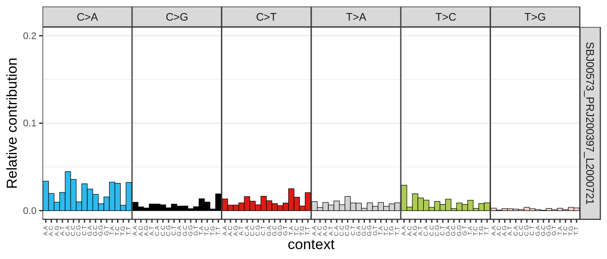

# FFPE

## Varlociraptor

Varlociraptor allows to call/filter variants specific [to differnet scenarios](https://varlociraptor.github.io/docs/calling/). Besides standard tumor/normal scenario handled by most of the somatic callers, it can be customized to work with a normal contaminated by tumor; to work with a 3rd sample (e.g. relapse, or pre-tumor); one of the scenarios is an FFPE sample.

> FFPE artifact detection: one can expect considerable rates of low-frequency C>T and G>A artifacts (see Do and Dobrovic, Clinical Chemistry 2014). The variant calling grammar allows to model them as a separate event, allowing to filter them away while considering the involved uncertainty:

```
samples:
  ffpetumor:
    universe: "[0.0,1.0]"
    resolution: 100

events:
  ffpe_artifact: "(C>T | G>A) & ffpetumor:]0.0,0.05["
  present: "((C>T | G>A) & ffpetumor:]0.05,1.0]) | (!(C>T | G>A) & ffpetumor:]0.0,1.0[)"
```

Trying it on an FFPE sample CUP1170. (Some irrelevant context: the sample was interesting because the TMB reported by PCGR was 5 mut/Mb, but TMB reported by PURPLE was 10 mut/Mb. The difference is likely because PURPLE considers the whole genome in contrast to just coding regions for PCGR (which are more conservatives). However it would have been good to exclude the possibility of FFPE artefacts messing with the calculations.)

Preprocessing, using bcbio ensemble calls as candiadates:

```
cd /g/data/gx8/extras/vlad/tmp/ffpe_cup/CUP1170/final/varloc

varlociraptor preprocess variants /g/data/gx8/extras/umccrise/genomes/hg38/hg38.fa --bam tumor.bam  --candidates candidates.vcf.gz --output varloc.tumor.bcf
varlociraptor preprocess variants /g/data/gx8/extras/umccrise/genomes/hg38/hg38.fa --bam normal.bam --candidates candidates.vcf.gz --output varloc.normal.bcf
```

Calling in a standard tumor/normal scenario:

```
varlociraptor call variants tumor-normal --purity 0.33 --tumor varloc.tumor.bcf --normal varloc.normal.bcf > varloc.rn.bcf
```

Now calling using the recommended yaml for an FFPE scenario:

```varloc_ffpe.yaml
samples:
  ffpetumor:
    universe: "[0.0,1.0]"
    resolution: 100

events:
  ffpe_artifact: "(C>T | G>A) & ffpetumor:]0.0,0.05["
  present: "((C>T | G>A) & ffpetumor:]0.05,1.0]) | (!(C>T | G>A) & ffpetumor:]0.0,1.0[)"
```

```
varlociraptor call variants --threads 16 generic --scenario varloc_ffpe.yaml --obs ffpetumor=varloc.tumor.bcf > varloc.ffpe.bcf
```

However for some reason if we filter out all calls with a high PROB_FFPE_ARTIFACT, we'll end up with only an FFPE noise and nothing else (all calls C>T and G>A).

```
bcftools view varloc.ffpe.bcf | grep -v "PROB_FFPE_ARTIFACT=inf" | bcftools stats
bcftools filter varloc.ffpe.bcf -i "PROB_FFPE_ARTIFACT<PROB_PRESENT" | bcftools stats
```

We'll try to modify the yaml as follows:

```varloc_ffpe2.yaml
samples:
  ffpetumor:
    universe: "[0.0,1.0]"
    resolution: 100

events:
  real: "!C>T | !G>A | ffpetumor:[0.05,1.0]"
  ffpe_artifact: "(C>T | G>A) & ffpetumor:[0.0,0.05["
```

```
varlociraptor call variants --threads 16 generic --scenario varloc_ffpe2.yaml --obs ffpetumor=varloc.tumor.bcf > varloc.ffpe2.bcf
```

How do we filter it now? Varlociraptor recommends to filter using a control-fdr function: 

```
varlociraptor filter-calls control-fdr varloc.ffpe2.bcf --events REAL --fdr 0.05 --var SNV > varloc.ffpe2.filt_fdr.bcf
```

It filters only down to 50315>45394 and leaves a lot of noize according to the SNP distribution. 

Instead of changing the FDR threshold, let's apply PROB_REAL>PROB_FFPE_ARTIFACT:

```
bcftools filter -i "PROB_REAL>PROB_FFPE_ARTIFACT" varloc.ffpe2.bcf | bcftools annotate -x "INFO/SVLEN" | bcftools sort | bcftools stats
```

We end up with just 14 variants. 

Filtering to PROB_REAL>0 looks better:

```
bcftools filter -i "PROB_REAL>0" varloc.ffpe2.bcf | bcftools view -Oz -o varloc.ffpe2.real.vcf.gz
```

Shrinks the size of the VCF from 50315 down to 28593. Though a lot of noise left (umccrise filtering left 25k variants, which is lower). 

Also if we look at the distribution:

```
export PATH=/g/data/gx8/extras/umccrise_2020_Aug/miniconda/envs/umccrise_cancer_report/bin:$PATH
Rscript -e "rmarkdown::render('signatures/signatures.Rmd', output_file='signatures/signatures.html')"
```


Compared to umccrised:



We'll see that more C>T noize is left with a Varlociraptor.

We can't move the PROB_REAL threshold any down further, so let's try to instead experiement with encreasing the PROB_FFPE_ARTIFACT thresholds. Setting it to >1000 leaves us with around 13k variants:

```
bcftools filter -e "PROB_FFPE_ARTIFACT>1000" varloc.ffpe2.bcf | bcftools annotate -x "INFO/SVLEN" | bcftools sort | bcftools view -Oz -o varloc.ffpe2.real.vcf.gz
```

However, for some reason the distribution shows they are all C>T. Weird.

Anyway, getting back to the controlled FDR filtering. Lowering the `--fdr` parameter down to a value where we left with 36385 variants:

```
varlociraptor filter-calls control-fdr varloc.ffpe2.bcf --events REAL --fdr 0.0005 --var SNV | bcftools view -Oz -o varloc.ffpe2.filt_fdr.vcf.gz
```

Now the distribution looks reasonable:


Compared to umccrised:


Now calculating the TMB for the PROB_REAL>0 variants using both PCGR and PURPLE:

```
# Removing the SVLEN field and sorting the VCF for further analysis with PCGR):
bcftools annotate -x "INFO/SVLEN" varloc.ffpe2.filt_fdr.vcf.gz | bcftools sort | bcftools view -Oz -o varloc.ffpe2.filt_fdr.fix.vcf.gz

pcgr_prep varloc.ffpe2.filt_fdr.fix.vcf.gz -o varloc.ffpe2.filt_fdr.fix.prepped.vcf.gz

export PATH=/g/data/gx8/extras/umccrise_2020_Aug/miniconda/envs/umccrise_pcgr/bin:$PATH
pcgr varloc.ffpe2.filt_fdr.fix.prepped.vcf.gz -g hg38 -o varloc.ffpe2.filt_fdr.fix.prepped.pcgr

export PATH=/g/data/gx8/extras/umccrise_2020_Aug/miniconda/envs/umccrise_hmf/bin:$PATH
bcftools view varloc.ffpe2.filt_fdr.fix.prepped.vcf.gz| sed s/ffpetumor/SBJ00573__SBJ00573_PRJ200397_L2000721/ > varloc.ffpe2.filt_fdr.fix.prepped.purplefix.vcf
PURPLE -Xms4g -Xmx16g -amber /g/data/gx8/extras/vlad/tmp/ffpe_cup/CUP1170/umccrised/work/SBJ00573__SBJ00573_PRJ200397_L2000721/purple/amber -cobalt /g/data/gx8/extras/vlad/tmp/ffpe_cup/CUP1170/umccrised/work/SBJ00573__SBJ00573_PRJ200397_L2000721/purple/cobalt -output_dir varloc.ffpe2.filt_fdr.fix.prepped.purplefix.purpled -reference SBJ00573_PRJ200396_L2000720  -tumor  SBJ00573__SBJ00573_PRJ200397_L2000721 -threads 16  -gc_profile /g/data/gx8/extras/vlad/synced/umccr/genomes/hg38/hmf/GC_profile.1000bp.cnp -structural_vcf /g/data/gx8/extras/vlad/tmp/ffpe_cup/CUP1170/umccrised/work/SBJ00573__SBJ00573_PRJ200397_L2000721/structural/filt/SBJ00573__SBJ00573_PRJ200397_L2000721-manta.vcf.gz -somatic_vcf varloc.ffpe2.filt_fdr.fix.prepped.purplefix.vcf -ref_genome /g/data/gx8/extras/vlad/synced/umccr/genomes/hg38/hg38.fa
```

PCGR TMb is now 5.53 (5-20 = Intermediate), PURPLE TMb is 12.725078698845751. Even higher now, but the ratio is about the same.


### Further


Also would be interesting to combine the FFPE with a tumor/normal calling, e.g. something like this:

```
samples:
  normal:
    resolution: 5
    universe: "0.0 | 0.5 | 1.0 | ]0.0,0.5["

  ffpetumor:
    universe: "[0.0,1.0]"
    resolution: 100

events:
  germline:        "normal:0.5 | normal:1.0"
  somatic_normal:  "normal:]0.0,0.5["
  real:            "normal:0 & (!C>T | !G>A | ffpetumor:[0.05,1.0])"
  ffpe_artifact:   "normal:0 & (C>T | G>A) & ffpetumor:]0.0,0.05["
```


