### BWA-MEM vs Minimap2: somatic variant calling 

We've been evaluating different variant callers with Minimap2 alignment data, with a goal to understand if we can replace slower BWA-MEM in our cancer variant calling pipleine. It appears that all callers, including Strelka2, do a great job, however we noticed some pecularities that might have to come from Strelka2 not been trained against Minimap2 data. Hope this might help to improve Strelka2.

We ran 3 variant calling pipelines (Strelka2, GATK, Vardict) using bcbio-nextgen with the data from 2 aligners (BWA-MEM and Minimap2), on 2 paired somatic, and 1 germline datasets. Below, 2-way Venn diagrams showing how Minimap2 compares against BWA-MEM, different variant callers - top to bottom, event types like SNPs true positives, indels true positives, SNP false positives, etc - left to right.

[Somatic T/N ICGC medulloblastoma dataset](https://www.nature.com/articles/ncomms10001) (`MB`)

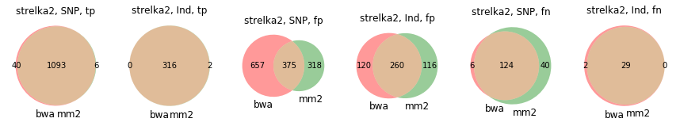

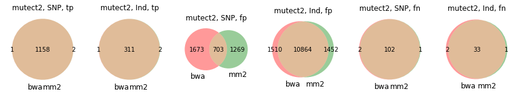

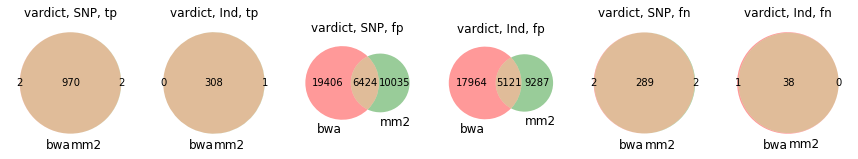

[Somatic T/N COLO829 dataset](https://www.ncbi.nlm.nih.gov/pmc/articles/PMC4837349) (`COLO`)

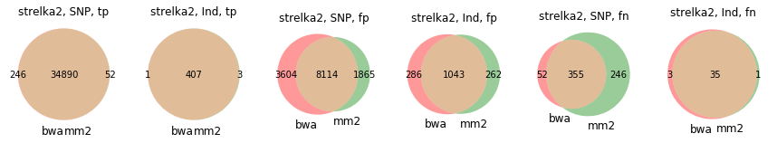

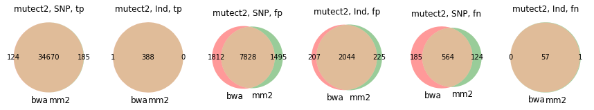

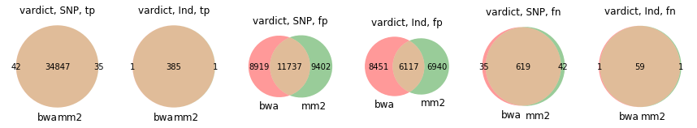

Germline GiaB NA12878 (`GiaB`). Only calculated false negatives here.

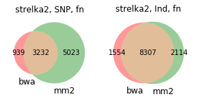

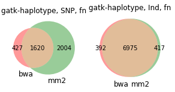

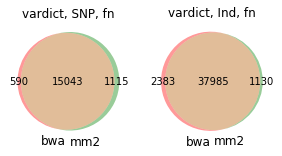

All callers seem to show a reasonably similar performance between the aligners. However, in all 3 datasets Strelka2 seem to generally miss more SNPs with Minimap2 compared to BWA-MEM:

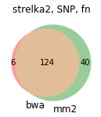 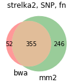 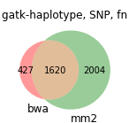

In contrast, 1. that doesn't seem to be evident with indels; 2. VarDict and Mutect2 don't show such discrepancy between the aligners. We guessed that Strelka2 might be making some assumptions based on some BWA-MEM features, e.g. SAM tag values, that might be reported differently in Minimap2, with other callers ignoring those features.

All 40 false negative SNPs from the `MB` study were rejected by Strelka2 as having a `LowEVS`. From 246 `COLO` false negative SNPs, 15 were not detected, and the rest rejected with `LowEVS`. We tried to see if there are any significant alignment differences in those sites, like in the coverage depth, mapping quality, alignment score, etc. We counted average VCF and SAM tag values.

Average stats for all Strelka calls:

```
                Missed by Strelka2+MM2           Cought by Strelka2 with MM2 and BWA
                MB              COLO             MB             COLO
                BWA    MM2      BWA    MM2       BWA   MM2      BWA    MM2 
SAM-AS          100.59 201.85   101.84 204.76    99.03 198.67   106.25 212.94 
SAM-XS           34.58 .         91.15 .         27.34  .        29.96   . 
SAM-NM            0.49 0.47       1.62 1.59       0.82  0.80      1.12   1.10 
SAM-MQ           58.74 57.54     34.99 30.07     59.76 58.88     58.73  58.31 
VCF-MQ           59.02 58.02     38.92 36.86     59.85 59.29     59.04  58.83  
VCF-MQ0           0.40 0.30      29.97 21.35      0.07  0.05      0.82   0.72    
VCF-AF            0.07 0.06       0.55 0.56       0.38  0.38      0.78   0.78   
VCF-DP          103.83 101.00    58.39 37.56     80.12 79.29     91.18  90.22   
ReadPosRankSum   -0.15 -0.12     -0.22 -0.14      0.06  0.05     -0.18  -0.18    
SomaticEVS        9.38 6.02       9.67 5.84      18.21 16.45     18.70  17.20     
```

As expected for false negatives, BWA-MEM's EVS is quite higher than Minimap's. It's also slightly larger as well for false positives. DP and VCF-MQ are a bit higher too for MB, and DP and SAM-MQ appear to be especially larger for FN in the COLO study. Also, AS is consistently _exactly_ twice as higher for Minimap2 for all variants, wondering if it anyhow might affect EVS? One more difference is Minimap2 missing the XS tag. 

Another curious observation is that the `MB` failed calls are all of quite low AF, unlike those for `COLO` which seem to have evenly distributed AFs:
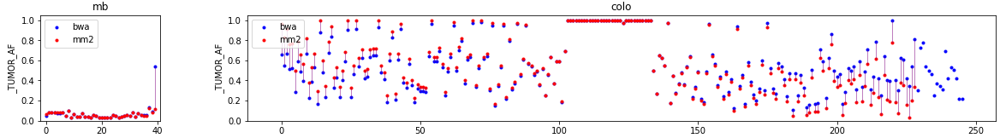

Eyeballing some variants, e.g. 1:50,854,774 from `MB`, it's interesting that EVS is twice as high, even though the rest of the tags are very close: both SAM and VCF `MQ` values are 59.89 vs. 58.84, `DP` 74 vs. 72, Allelic depth is 6 for both calls, `ReadPosRankSum` is close to 0 for both. However, `SomaticEVS` differs quite a lot (12.82 vs. 6.77):

``` Strelka2 BWA (batch1-strelka2-annotated-bwa.vcf.gz)
1       50854774        .       T       C       .       PASS    AC=1;AF=0.25;AN=4;DP=159;MQ=59.89;MQ0=0;NT=ref;QSS=75;QSS_NT=75;ReadPosRankSum=-0.14;SGT=TT->CT;SNVSB=0;SOMATIC;SomaticEVS=12.82;TQSS=1;TQSS_NT=1;ANN=C|intergenic_region|MODIFIER|RP11-183G22.1-HMGB1P45|ENSG00000234080-ENSG00000229316|intergenic_region|ENSG00000234080-ENSG00000229316|||n.50854774T>C||||||     GT:AU:CU:DP:FDP:GU:SDP:SUBDP:TU 0/0:0,0:0,0:78:0:0,0:0:0:78,82  0/1:0,0:6,6:74:0:0,0:0:0:68,71
```

``` Strelka2 Minimap2 (mb_strelka_snp_uniq_fn.normalised.vcf.gz)
1       50854774        .       T       C       .       LowEVS  AC=1;AF=0.25;AN=4;DP=158;MQ=58.84;MQ0=0;NT=ref;QSS=75;QSS_NT=75;ReadPosRankSum=-0.03;SGT=TT->CT;SNVSB=0;SOMATIC;SomaticEVS=6.77;TQSS=1;TQSS_NT=1;ANN=C|intergenic_region|MODIFIER|RP11-183G22.1-HMGB1P45|ENSG00000234080-ENSG00000229316|intergenic_region|ENSG00000234080-ENSG00000229316|||n.50854774T>C||||||;TUMOR_AF=0.0833333333333;NORMAL_AF=0.0;TUMOR_DP=72;NORMAL_DP=77;TUMOR_MQ=58.84000015258789     GT:AU:CU:DP:FDP:GU:SDP:SUBDP:TU 0/0:0,0:0,0:77:0:0,0:0:0:77,82  0/1:0,0:6,6:72:0:0,0:0:0:66,70
```

That variant was cought by Mutect2 and VarDict for both BWA and Minimap2. That does seem to be a pattern for both datasets: most of Strelka2 FN were cought by both Mutect2 and VarDict (consistently in BWA and Minimap2 case).

In general, even though showing a lower performance than Strelka2, VarDict and Mutect2 seem to be stable when switching between the aligners.

Interestingly, of 40 MB SNPs, 2 were actually called by Strelka2 with a different ALT. For `12:38153362`, the correct alelle is T>C which was called with BWA by all callers, and with Minimap2 with VarDict and Mutect2; however Strelka2 reported T>G with Minimap2 here:

COLO BWA, strelka2:

```
12		38153362	.	T	C	.	PASS	AC=1;AF=0.25;AN=4;DP=343;MQ=42.98;MQ0=58;NT=ref;QSS=142;QSS_NT=142;ReadPosRankSum=-0.47;SGT=TT->CT;SNVSB=0;SOMATIC;SomaticEVS=11.33;TQSS=2;TQSS_NT=2;ANN=C|intergenic_region|MODIFIER|RP11-125N22.2-RP11-297L6.2|ENSG00000258368-ENSG00000257173|intergenic_region|ENSG00000258368-ENSG00000257173|||n.38153362T>C||||||	
        GT:  AU:  CU:    DP: FDP: GU:   SDP:SUBDP: TU
Normal: 0/0: 0,0: 0,0:   82: 2:   0,9:  0:0:       80,146
Tumor:  0/1: 0,0: 33,33: 89: 0:   0,13: 0:0:       56,142

```

COLO minimap2, strelka2:

```
12		38153362	.	T	G	.	PASS	AC=1;AF=0.25;AN=4;DP=297;MQ=45.74;MQ0=11;NT=ref;QSS=112;QSS_NT=112;ReadPosRankSum=-0.47;SGT=TT->GT;SNVSB=0;SOMATIC;SomaticEVS=12.83;TQSS=2;TQSS_NT=2;ANN=G|intergenic_region|MODIFIER|RP11-125N22.2-RP11-297L6.2|ENSG00000258368-ENSG00000257173|intergenic_region|ENSG00000258368-ENSG00000257173|||n.38153362T>G||||||	
        GT:  AU:  CU:    DP: FDP: GU:   SDP:SUBDP: TU
Normal: 0/0: 0,1: 0,0:   82: 1:   0,26: 0:0:       81,113
Tumor:  0/1: 0,3: 33,33: 89: 0:   0,36: 0:0:       56,85         
```

Even though the 1st-tier allelic depth for G is 0, the variant was called as T>G.

We are wondering if in general, the discrepancy for Strelka2 comes from the alignment decisions Minimap2 makes differently from BWA (leading to diffences in coverage and reads aligner), or it might have to do with different ways to calculate and report particular SAM tags (like AS, XS)? If Strelka2's model were trained with Minimap2 data, would it improve the performance, or it has to do with Minimap2 beeing less accurate than BWA-MEM?. We would be happy to share any data and the details of the runs!
