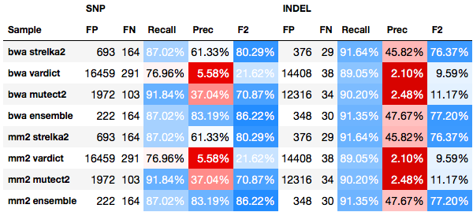
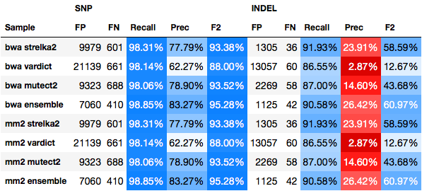

##  WGS somatic tumor/normal variant calling validation

Variant calling performed with bcbio-nextgen 1.0.8, using 3 variant callers:

- [Strelka2](https://github.com/Illumina/strelka)
- [VarDict](https://github.com/AstraZeneca-NGS/VarDict) (variant filtering http://bcb.io/2016/04/04/vardict-filtering/, allele frequency threshold is set to 10% to avoid excessive false positive rates and runtimes).
- [Mutect2](https://software.broadinstitute.org/gatk/documentation/tooldocs/3.8-0/org_broadinstitute_gatk_tools_walkers_cancer_m2_MuTect2.php)

Ensemble calls contain variants detected with any 2 out of 3 callers above.

For each sample and caller, also using two differrent aligners: [BWA-MEM](https://github.com/lh3/bwa) and [minimap2](https://github.com/lh3/minimap2)

### ICGC medulloblastoma

- Paper: [https://www.nature.com/articles/ncomms10001](https://www.nature.com/articles/ncomms10001)
- Tumor purity: 95–98%
- Tumor: 103x, normal: 89x (downsampled from tumor: 314x, normal: 272x)

### COLO829 metastatic melanoma cell line

- Paper: [https://www.ncbi.nlm.nih.gov/pmc/articles/PMC4837349](https://www.ncbi.nlm.nih.gov/pmc/articles/PMC4837349)
- BAM file from TGEN
- Tumor: 81x, normal: 79x

