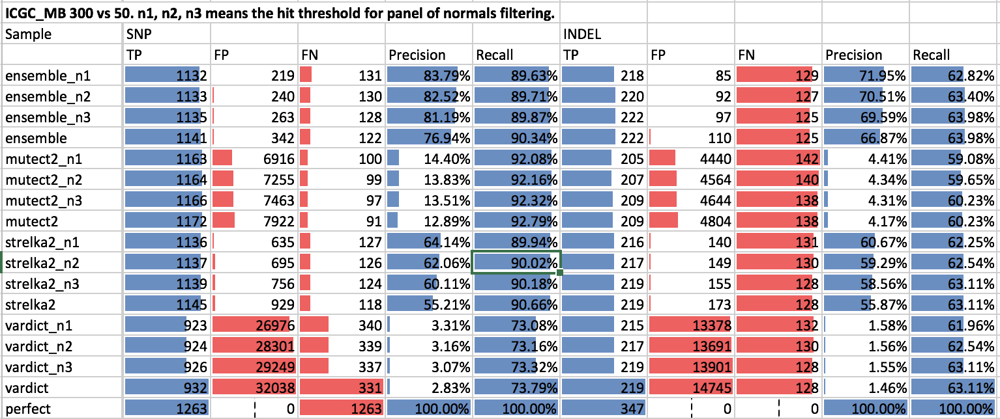

Panel of normals
================

Using a sample from a normal tissue as a baseline for cancer variant calling allows to get rid of pre-existing "germline" calls in the tissue. 
However due to the following issues this method might still fail to filter out some false positives:
- sequencing or alignment artefacts that failed to be filtered in "tumor",
- real germline variants, not called in "normal" due to insufficient coverage in normal samples in those regions (e.g. due to low GC, unbalanced structural variants).

Applying a set unrelated normal samples to filter false positives might help to reduce the FP number by partly addressing the second factor. The poorly covered regions from the matched normal might turn out to be sufficiently covered in unrelated normals.

Matt Eldridge used an SNV panel from 149 blood normals from the oesophageal ICGC project to flag variants that are observed in:
* at least 5 unrelated normals
* in each, minimum variant allele fraction of 0.05
* in each, minimum allele count of 3.
He evaluated against two validation truth sets:
1. MuTect2 from DREAM challenge synthetic 4 dataset results: precision 0.91 -> 0.97 while the sensitivity is only marginally reduced, remaining at 0.75.
2. ICGC benchmark datasets, MuTect2 and Strelka: improves not in quite such spectacular fashion, possibly reflecting the relative similarity of the sequencing carried out for these datasets compared with that run on our oesophageal samples.

### Samples

We are building a panel from normal samples used in UMCCR. Currently, the following are used:
```
MH17B001P004              /data/cephfs/punim0010/data/Results/Avner/MH17T001P004/2017-07-27_final/2017-06-15_MH17T001P004/MH17B001P004-germline-ensemble-annotated.vcf.gz
MH17B001P013              /data/cephfs/punim0010/data/Results/Avner/MH17T001P013/final/2017-06-15_MH17T001P013/MH17B001P013-germline-ensemble-annotated.vcf.gz           
VPH52_Blood               /data/cephfs/punim0010/data/Results/Tothill-Research/VPH/2017-08-16_tothill_pilot/germline/VPH52_Blood-germline-ensemble-annotated.vcf.gz      
VPH54_Blood               /data/cephfs/punim0010/data/Results/Tothill-Research/VPH/2017-08-16_tothill_pilot/germline/VPH54_Blood-germline-ensemble-annotated.vcf.gz      
VPH56_Blood               /data/cephfs/punim0010/data/Results/Tothill-Research/VPH/2017-08-16_tothill_pilot/germline/VPH56_Blood-germline-ensemble-annotated.vcf.gz      
VPH58_Blood               /data/cephfs/punim0010/data/Results/Tothill-Research/VPH/2017-08-16_tothill_pilot/germline/VPH58_Blood-germline-ensemble-annotated.vcf.gz      
VPH59_Blood               /data/cephfs/punim0010/data/Results/Tothill-Research/VPH/2017-08-16_tothill_pilot/germline/VPH59_Blood-germline-ensemble-annotated.vcf.gz      
VPH61_Blood               /data/cephfs/punim0010/data/Results/Tothill-Research/VPH/2017-08-16_tothill_pilot/germline/VPH61_Blood-germline-ensemble-annotated.vcf.gz      
NA12878-1VD               /data/cephfs/punim0010/projects/Hsu_WGS_Validation/WGS-GiaB-merged/final/2017-11-13_giab-merged/UtahMormon-1-ensemble-annotated.vcf.gz
NA24631-1KC               /data/cephfs/punim0010/projects/Hsu_WGS_Validation/WGS-GiaB-merged/final/2017-11-13_giab-merged/HanChinese-4-ensemble-annotated.vcf.gz
NA24385-1LL               /data/cephfs/punim0010/projects/Hsu_WGS_Validation/WGS-GiaB-merged/final/2017-11-13_giab-merged/AshkenazimJew-1-ensemble-annotated.vcf.gz
MDx150891                 /data/cephfs/punim0010/projects/Hsu_WGS_Validation/WGS-ALLOCATE-MDx150892-merged/final/2017-07-07_WGS-ALLOCATE-MDx150892-merged/MDx150891-germline-ensemble-annotated.vcf.gz
COLO829Bld-CCR170091a     /data/cephfs/punim0010/projects/Hofmann_Catchup/catchup_colo829/2017-11-17_Final/2017-11-09_catchup_colo829/COLO829_normal-ensemble-annotated.vcf.gz
BriGibBld-PRJ170155_S3    /data/cephfs/punim0010/data/Results/Patients/BriGib/final/2017-10-20_brigibFFPE/BriGibBld-ensemble-annotated.vcf.gz
17MHP031Bld-CCR170089_S1  /data/cephfs/punim0010/data/Results/Avner/MH17B001P031/final/2017-09-19_17MHP031/17MHP031Bld-germline-ensemble-annotated.vcf.gz
MH17B001P010              /data/cephfs/punim0010/data/Results/Avner/MH17B001P010/final/2017-10-19_MH17B001P010/MH17B001P010-ensemble-annotated.vcf.gz
17MHP002Bld-CCR170002     /data/cephfs/punim0010/data/Results/Avner/MH17B001P002/final/2017-10-23_MH17B001P002/17MHP002Bld-ensemble-annotated.vcf.gz
WES013BL                  /data/cephfs/punim0010/projects/Hsu_WGS_Validation/WGS-WES013PF-merged/final/2017-07-17_WGS-WES013PF-merged/WES013PFBL-germline-ensemble-annotated.vcf.gz
WES012MVBL                /data/projects/punim0010/projects/Hsu_WGS_Validation/WGS-WES012MV-merged/final/2017-07-05_WGS-WES012MV-merged/WES012MVBL-germline-ensemble-annotated.vcf.gz
WES003KMBL                /data/projects/punim0010/projects/Hsu_WGS_Validation/WGS-WES003KM-merged/final/2017-06-19_AGRF15-00335_H23HJDMXX_WES003KM-merged/WES003KMBL-germline-ensemble-annotated.vcf.gz
```

### Annotating

The following code is used to annotate a VCF sample against the set of normals (given that VCF name is na12878_1vd_vs_2vd-vardict-annotated.vcf.gz) It will add an `INFO` key `PoN_CNT`, showing the number of hits in the panel:
```bash
python make_vcfanno_cnf.py > vcfanno.toml
vcfanno -lua code.lua vcfanno.toml na12878_1vd_vs_2vd-vardict-annotated.vcf.gz > na12878_1vd_vs_2vd-vardict-annotated-pon.vcf
bgzip na12878_1vd_vs_2vd-vardict-annotated-pon.vcf
tabix -p vcf na12878_1vd_vs_2vd-vardict-annotated-pon.vcf.gz
```

### Filtering

To filter out variants met at least 2 times in the panel:
```bash
bcftools filter -i "INFO/PoN_CNT>=2" na12878_1vd_vs_2vd-vardict-annotated-pon.vcf.gz -Oz -o na12878_1vd_vs_2vd-vardict-annotated-pon-n2.vcf.gz
```

### Evaluation

Using Heng Li's [rtgeval](https://github.com/lh3/rtgeval) tool to compare against GiaB variants truth set. The tool normalizes variants, compares to truth set in specified regions, and reports numbers of FP/FN/TN.

Subsample to 1 main sample:
```bash
bcftools view -s 1VD na12878_1vd_vs_2vd-vardict-annotated-pon-n2.vcf.gz -Oz -o na12878_1vd_vs_2vd-vardict-annotated-pon-n2-sample.vcf.gz
```

```bash
cd /home/vlad/validation
./rtgeval.kit/run-eval -s /home/vlad/bcbio/genomes/Hsapiens/GRCh37/rtg/GRCh37.sdf \
    -b $HOME/bcbio/genomes/Hsapiens/GRCh37/validation/giab-NA12878-NA24385-somatic/truth_regions.bed \
    $HOME/bcbio/genomes/Hsapiens/GRCh37/validation/giab-NA12878-NA24385-somatic/truth_small_variants.vcf.gz \ 
    na12878_1vd_vs_2vd-vardict-annotated-pon-n1-sample.vcf.gz
```

The results will be in `na12878_1vd_vs_2vd-vardict-annotated-pon-n1-sample.re.eval`

### Using 2 differrent NA12878 as a T/N pair

Two NA12878 samples running as a T/N pair ideally should yeild zero somatic variants. However, in real world the output will be non-empty. Since all real variants should cancel out, the remainings are assumed to be false positives. We count how many of them are removed by applying the panel of normals, making sure that it doesn't reduce the true positive count significantly.

```                      SNP                                              INDEL
                         TP   FP     FN         Precision  Sensitivity    TP   FP   FN      Precision  Sensitivity
1VDvs2VD                 217  2,482  1,007,778  8.04%      0.02%          30   858  98,346  3.38%      0.03%
1VDvs2VD, 1 hit in PoN   78   150    1,007,917  34.21%     0.01%          4    14   98,372  22.22%     0.00%
1VDvs2VD, 2 hits in PoN  65   134    1,007,930  32.66%     0.01%          1    11   98,375  8.33%      0.00%
```

The reduction of false positives is significant.

Just for the demonstration, applying to original variant calls, sensititity drops significancatly because of the large amount of germline variants shared between these samples and the samples in the panel:
```
1VD          1,007,291  1,948,935  704      34.07%  99.93%    97762  240731    614  28.88%  99.38%
1VD, 2 hits  292,624    73,936     715,371  79.83%  29.03%    42172   87484  56204  32.53%  42.87%
1VD, 1 hit   171,940    37,439     836,055  82.12%  17.06%    32507   84206  65869  27.85%  33.04%
```

### ICGC MB

On the image below, evaluation of the ICGC MB T/N variant calling with 300x tumor coverage, and 50 normal coverage. The number in `vardict_n1` means how many heats in PoN we allow before we filter out the variant.




