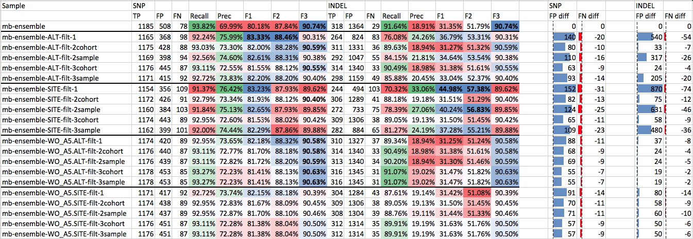
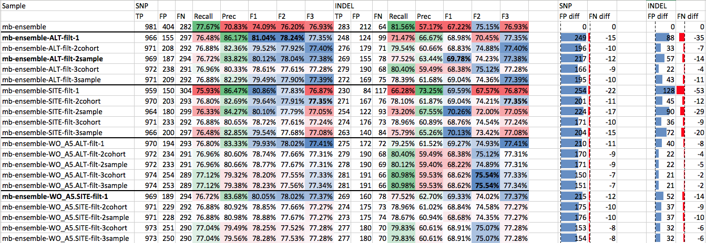
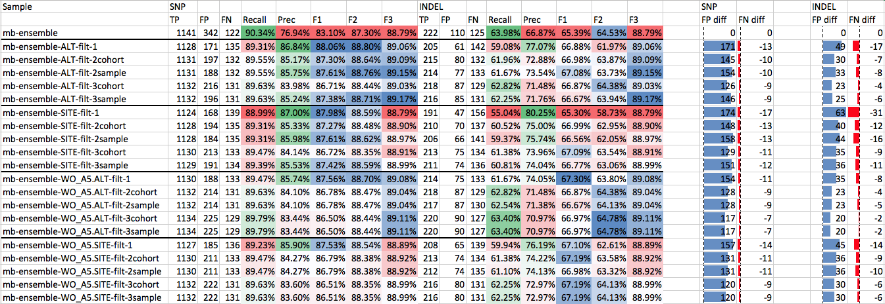
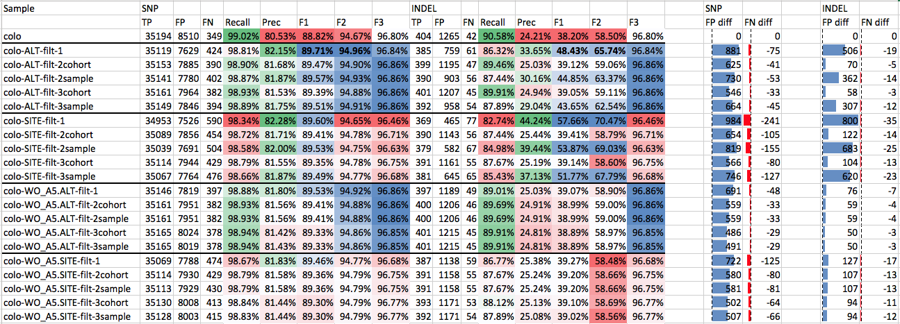
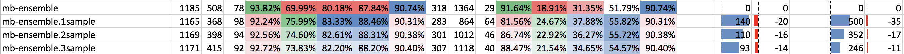

Panel of normals
================

Using a sample from a normal tissue as a baseline for cancer variant calling allows to get rid of pre-existing "germline" calls in the tissue. 
However due to the following issues this method might still fail to filter out some false positives:
- sequencing or alignment artefacts that failed to be filtered in "tumor",
- real germline variants, not called in "normal" due to insufficient coverage in normal samples in those regions (e.g. due to low GC, unbalanced structural variants).

Applying a set unrelated normal samples to filter false positives might help to reduce the FP number by partly addressing the second factor. The poorly covered regions from the matched normal might turn out to be sufficiently covered in unrelated normals.

Matt Eldridge used an SNV panel from 149 blood normals from the oesophageal ICGC project to flag variants that are observed in:
* at least 5 unrelated normals
* in each, minimum variant allele fraction of 0.05
* in each, minimum allele count of 3.
He evaluated against two validation truth sets:
1. MuTect2 from DREAM challenge synthetic 4 dataset results: precision 0.91 -> 0.97 while the sensitivity is only marginally reduced, remaining at 0.75.
2. ICGC benchmark datasets, MuTect2 and Strelka: improves not in quite such spectacular fashion, possibly reflecting the relative similarity of the sequencing carried out for these datasets compared with that run on our oesophageal samples.

## Designing the panel

We are building a panel from germline calls from normal (non-cancer) samples used in UMCCR. Currently, [this list](normals.yaml) is used.

We want to explore the following things:

- How many occurences in a panel we want to allow to keep variant or filter?
- Samples come from different cohorts, and large cohorts can dominate small ones, bringing a bias. Do we want to collapse cohorts?
- To call a hit, should require the exact allele matching, or just variant location is enough?
- Should we split multiallelics in the panel of normals? Might correllate with the previous point.

The panel if built by merging preliminary [normalized](https://github.com/umccr/vcf_stuff#vcf-normalisation) VCFs. Repetitive variants we collapse and put a `PoN_CNT` field with a number of occurrences of that variant (see code in `Snakemake.prep_normals`). For the testing pusposes, we put separate `PoN_samples` and `PoN_cohorts` to explore if we want to collapse cohorts. Also for testing, we make 4 versions panels, using all combinations of the following:
  - With merged multiallelics:
	- merged with `bcftools merge -m all`
  - With split multiallelics:
	- all normals pre-normalized with `norm_vcf` which splits multiallelics
	- merged with `bcftools merge -m none`
  - With the large A5 cohort (30 samples versus remaining 20) and without.

Plus, we make a panel from normals that don't undergo any normalization (however some of them are normalized in bcbio, which since a recent release started to pre-normalized ensemble calls). 

```
panel_of_normals.vcf.gz						    # NOT pre-normalized normals, without A5
panel_of_normals.NOT_NORMALIZED.vcf.gz 		    # NOT pre-normalized normals, with A5
panel_of_normals.NEW.vcf.gz        				# Merged multiallelics, with A5
panel_of_normals.WO_A5.vcf.gz					# Merged multiallelics, without A5
panel_of_normals.NO_MULTIALLELIC.vcf.gz			# Split multiallelics, with A5
panel_of_normals.NO_MULTIALLELIC.WO_A5.vcf.gz   # Split multiallelics, without A5
```

### Eyeballing different versions of PoN

Here we review how 1. pre-normalization of normals; 2. using `bcftools merge -m none` vs the default `bcftools merge -m both` to skip merging multiallelic; and 3. the presence of the large A5 cohort (30 samples) affects the panel. We eyeball the variant that appears to be as A>G or A>T or multiallelic in different noraml samples:

```
normal vcfs NOT pre-normalized, no A5:
panel_of_normals.vcf.gz:1                        15274  rs2758118  A  G,T  6947.5  PASS  PoN=13                       

normal vcfs NOT pre-normalized (however the new cohort A5 is pre-normalized and split-multialleic, so it brings a separate A>G):
panel_of_normals.NOT_NORMALIZED.vcf.gz:1         15274  rs2758118  A  G,T  6947.5  PASS  PoN_cohorts=14;PoN_samples=43
panel_of_normals.NOT_NORMALIZED.vcf.gz:1         15274  rs2758118  A  G    224     PASS  PoN_cohorts=1;PoN_samples=29 
14 cohorts have A->G,T, one has A->G. In reality, those 14 are not normalized, and the one is normalized. 
Thus the one has A>G and A>T separately, whereas the rest have a multiallelic call.

normal vcfs normalized, but merged without -m none:
panel_of_normals.NEW.vcf.gz:1                    15274  rs2758118  A  G    6947.5  PASS  PoN_cohorts=10;PoN_samples=38
panel_of_normals.NEW.vcf.gz:1                    15274  rs2758118  A  T    6947.5  PASS  PoN_cohorts=14;PoN_samples=43
wc -l 17754387

normal vcfs normalized, but merged without -m none; no A5
panel_of_normals.WO_A5.vcf.gz:1                  15274  rs2758118  A  T    6947.5  PASS  PoN_cohorts=13;PoN_samples=13
panel_of_normals.WO_A5.vcf.gz:1                  15274  rs2758118  A  G    6947.5  PASS  PoN_cohorts=9;PoN_samples=9  
wc -l 10857590

normal vcfs normalized, merged with -m none
panel_of_normals.NO_MULTIALLELIC.vcf.gz:1        15274  rs2758118  A  T    6947.5  PASS  PoN_cohorts=14;PoN_samples=43
panel_of_normals.NO_MULTIALLELIC.vcf.gz:1        15274  rs2758118  A  G    6947.5  PASS  PoN_cohorts=10;PoN_samples=38
wc -l 18664962

normal vcfs normalized, merged with -m none: no A5
panel_of_normals.NO_MULTIALLELIC.WO_A5.vcf.gz:1  15274  rs2758118  A  T    6947.5  PASS  PoN_cohorts=13;PoN_samples=13
panel_of_normals.NO_MULTIALLELIC.WO_A5.vcf.gz:1  15274  rs2758118  A  G    6947.5  PASS  PoN_cohorts=9;PoN_samples=9  
wc -l 10888111
```

Apparantely `-m none` doesn't affect the result when there are normal VCFs having both variants, e.g.:

```
17MHP002Bld.clean.norm.1_15274.vcf.gz:1 15274   rs2758118       A       G       6947.5  PASS    .       GT      1|0
17MHP002Bld.clean.norm.1_15274.vcf.gz:1 15274   rs2758118       A       T       6947.5  PASS    .       GT      0|1
17MHP031Bld-germline.clean.norm.1_15274.vcf.gz:1        15274   rs2758118       A       G       6239.6  PASS    .       GT      1|0
17MHP031Bld-germline.clean.norm.1_15274.vcf.gz:1        15274   rs2758118       A       T       6239.6  PASS    .       GT      0|1 
```

However, if we take the following one where each allele appears in different normals:

```
COLO829_normal.clean.norm.1_28682.vcf.gz:1      28682   .       G       A       141     PASS    .       GT      0/1
MH17B001P004-germline.clean.norm.1_28682.vcf.gz:1       28682   .       G       T       111     PASS    .       GT      0/1
```

`-m none` starts to make the difference:

```
panel_of_normals.WO_A5.vcf.gz
< 1   28682  .  G	A,T	  141      PASS  PoN_cohorts=6;PoN_samples=7
panel_of_normals.NO_MULTIALLELIC.WO_A5.vcf.gz
> 1   28682  .	G	A	  141      PASS  PoN_cohorts=1;PoN_samples=1
> 1   28682  .	G	T	  111      PASS  PoN_cohorts=5;PoN_samples=6
```

We can see here that splitting multiallelic should be done when we compare ALT, and multiallelic should be merged when we compare SITE. Say, G>T is also PoN_cohorts=1;PoN_samples=1 in the PoN, and we require more than 1 hit: In this case, none of the variants will support filtering; however, if we check by ALT, that's be correct. Also for comparing SITE, we don't need to explicitly pre-merge all multiallelics in separate normals, as each variant will contribute to the count. However, we should do normalization in any case, as normalizing indels may benefit both for ALT and SITE.

### Evaluate on ICGC-MB

To answer the remaining questions and derive the best parameters, we evaluate filtering with the panels on a tumor VCF from [ICGC MB study](https://github.com/umccr/vcf_stuff/tree/master/analysis/somatic_calling_evaluation#icgc-medulloblastoma). We start with 100x tumor / 100x normal, called with ensemble approach in bcbio-nextgen.

```
cd /data/cephfs/punim0010/extras/panel_of_normals/test
cp /data/cephfs/punim0010/projects/Saveliev_ICGC_MB/mb_workflow_bwa/final/2018-03-21_mb_workflow/batch1-ensemble-annotated.vcf.gz mb-ensemble.vcf.gz
cp /data/cephfs/punim0010/projects/Saveliev_ICGC_MB/mb_workflow_bwa/final/2018-03-21_mb_workflow/batch1-ensemble-annotated.vcf.gz.tbi mb-ensemble.vcf.gz.tbi
```

We annotate the VCF in following 8 different ways: with samples and cohorts; requiring ALT matching (against the split-multiallelic panel) or just SITE (against the merged-multialleic panel); and including A5 cohort or not. For that, we prepare 8 tomls for `vcfanno`.

```
samples.NO_MULTIALLELIC.toml
samples.NO_MULTIALLELIC.WO_A5.toml
cohorts.NO_MULTIALLELIC.toml
cohorts.NO_MULTIALLELIC.WO_A5.toml
samples.toml
samples.WO_A5.toml
cohorts.toml
cohorts.WO_A5.toml

vcfanno samples.NO_MULTIALLELIC.toml mb-ensemble.vcf.gz | bgzip -c > mb-ensemble.S_ALT.vcf.gz
vcfanno cohorts.NO_MULTIALLELIC.toml mb-ensemble.S_ALT.vcf.gz | bgzip -c > mb-ensemble.ALT.vcf.gz && rm mb-ensemble.S_ALT.vcf.gz
vcfanno -permissive-overlap samples.toml mb-ensemble.vcf.gz | bgzip -c > mb-ensemble.S_SITE.vcf.gz
vcfanno -permissive-overlap cohorts.toml mb-ensemble.S_SITE.vcf.gz | bgzip -c > mb-ensemble.SITE.vcf.gz && rm mb-ensemble.S_SITE.vcf.gz

vcfanno samples.NO_MULTIALLELIC.WO_A5.toml mb-ensemble.vcf.gz | bgzip -c > mb-ensemble.WO_A5.S_ALT.vcf.gz
vcfanno cohorts.NO_MULTIALLELIC.WO_A5.toml mb-ensemble.WO_A5.S_ALT.vcf.gz | bgzip -c > mb-ensemble.WO_A5.ALT.vcf.gz && rm mb-ensemble.WO_A5.S_ALT.vcf.gz
vcfanno -permissive-overlap samples.WO_A5.toml mb-ensemble.vcf.gz | bgzip -c > mb-ensemble.WO_A5.S_SITE.vcf.gz
vcfanno -permissive-overlap cohorts.WO_A5.toml mb-ensemble.WO_A5.S_SITE.vcf.gz | bgzip -c > mb-ensemble.WO_A5.SITE.vcf.gz && rm mb-ensemble.WO_A5.S_SITE.vcf.gz
```

Now filtering with different thresholds (1, 2, or 3 hits):

```
bcftools filter -e "INFO/PoN_cohorts>=1" mb-ensemble.SITE.vcf.gz -Oz -o mb-ensemble-SITE-filt-1.vcf.gz 
bcftools filter -e "INFO/PoN_cohorts>=2" mb-ensemble.SITE.vcf.gz -Oz -o mb-ensemble-SITE-filt-2cohort.vcf.gz 
bcftools filter -e "INFO/PoN_samples>=2" mb-ensemble.SITE.vcf.gz -Oz -o mb-ensemble-SITE-filt-2sample.vcf.gz
bcftools filter -e "INFO/PoN_cohorts>=3" mb-ensemble.SITE.vcf.gz -Oz -o mb-ensemble-SITE-filt-3cohort.vcf.gz 
bcftools filter -e "INFO/PoN_samples>=3" mb-ensemble.SITE.vcf.gz -Oz -o mb-ensemble-SITE-filt-3sample.vcf.gz

bcftools filter -e "INFO/PoN_cohorts>=1" mb-ensemble.ALT.vcf.gz -Oz -o mb-ensemble-ALT-filt-1.vcf.gz 
bcftools filter -e "INFO/PoN_cohorts>=2" mb-ensemble.ALT.vcf.gz -Oz -o mb-ensemble-ALT-filt-2cohort.vcf.gz 
bcftools filter -e "INFO/PoN_samples>=2" mb-ensemble.ALT.vcf.gz -Oz -o mb-ensemble-ALT-filt-2sample.vcf.gz
bcftools filter -e "INFO/PoN_cohorts>=3" mb-ensemble.ALT.vcf.gz -Oz -o mb-ensemble-ALT-filt-3cohort.vcf.gz 
bcftools filter -e "INFO/PoN_samples>=3" mb-ensemble.ALT.vcf.gz -Oz -o mb-ensemble-ALT-filt-3sample.vcf.gz

bcftools filter -e "INFO/PoN_cohorts>=1" mb-ensemble.WO_A5.SITE.vcf.gz -Oz -o mb-ensemble-WO_A5.SITE-filt-1.vcf.gz 
bcftools filter -e "INFO/PoN_cohorts>=2" mb-ensemble.WO_A5.SITE.vcf.gz -Oz -o mb-ensemble-WO_A5.SITE-filt-2cohort.vcf.gz 
bcftools filter -e "INFO/PoN_samples>=2" mb-ensemble.WO_A5.SITE.vcf.gz -Oz -o mb-ensemble-WO_A5.SITE-filt-2sample.vcf.gz
bcftools filter -e "INFO/PoN_cohorts>=3" mb-ensemble.WO_A5.SITE.vcf.gz -Oz -o mb-ensemble-WO_A5.SITE-filt-3cohort.vcf.gz 
bcftools filter -e "INFO/PoN_samples>=3" mb-ensemble.WO_A5.SITE.vcf.gz -Oz -o mb-ensemble-WO_A5.SITE-filt-3sample.vcf.gz

bcftools filter -e "INFO/PoN_cohorts>=1" mb-ensemble.WO_A5.ALT.vcf.gz -Oz -o mb-ensemble-WO_A5.ALT-filt-1.vcf.gz 
bcftools filter -e "INFO/PoN_cohorts>=2" mb-ensemble.WO_A5.ALT.vcf.gz -Oz -o mb-ensemble-WO_A5.ALT-filt-2cohort.vcf.gz 
bcftools filter -e "INFO/PoN_samples>=2" mb-ensemble.WO_A5.ALT.vcf.gz -Oz -o mb-ensemble-WO_A5.ALT-filt-2sample.vcf.gz
bcftools filter -e "INFO/PoN_cohorts>=3" mb-ensemble.WO_A5.ALT.vcf.gz -Oz -o mb-ensemble-WO_A5.ALT-filt-3cohort.vcf.gz 
bcftools filter -e "INFO/PoN_samples>=3" mb-ensemble.WO_A5.ALT.vcf.gz -Oz -o mb-ensemble-WO_A5.ALT-filt-3sample.vcf.gz
```

Using [vcf_eval](https://github.com/umccr/vcf_stuff#variant-calling-evaluataion), we evaluate all VCFs against the ICGC-MB truth set.

```
eval_vcf mb mb-ensemble.vcf.gz *filt*.vcf.gz -o eval -j 24
```



### Unbalanced coverage

A more interesting example would be a tumor/normal pair with unbalanced tumor/normal coverage, where the normal coverage is significantly lower - in such cases, the panel of normals can resque some artefacts appearing due to gaps in normal.

Tumor 100x vs normal 50x:

```
cd /data/cephfs/punim0010/extras/panel_of_normals/test_mb_100_50
cp /data/cephfs/punim0010/projects/Saveliev_ICGC_MB/bcbio_300_50/final_af10/2017-11-22_bcbio/MB_300vs50-ensemble-annotated-decomposed.vcf.gz mb-ensemble.vcf.gz
...
eval_vcf mb mb-ensemble.vcf.gz *filt*.vcf.gz -o eval -j 24
```



Tumor 300x vs normal 50x:

```
cd /data/cephfs/punim0010/extras/panel_of_normals/test_mb_300_50
cp /data/cephfs/punim0010/projects/Saveliev_ICGC_MB/bcbio_300_50/final_af10/2017-11-22_bcbio/MB_300vs50-ensemble-annotated-decomposed.vcf.gz mb-ensemble.vcf.gz
...
eval_vcf mb mb-ensemble.vcf.gz *filt*.vcf.gz -o eval -j 24
```



### COLO829

We also evaluate the panel on a [COLO829 tumor/normal pair](https://github.com/umccr/vcf_stuff/tree/master/analysis/somatic_calling_evaluation#colo829-metastatic-melanoma-cell-line):

```
cd /data/cephfs/punim0010/extras/panel_of_normals/test_colo
cp /data/cephfs/punim0010/projects/Saveliev_COLO829_Craig/bcbio_bwa/final.beforeStrelkaReportEVSFeatures/2018-03-01_bcbio_bwa/COLO_TGEN_bwa-ensemble-annotated.vcf.gz colo.vcf.gz
...
eval_vcf colo colo.vcf.gz *filt*.vcf.gz -o eval -j 24
```



### Results

We can see that adding A5 cohort improves the result, and filtering by ALT seems to make a positive effect overall.

F2 weights recall twice as higher than it does F1, and F3 goes 3 times higher. But we probably don't need to weigh the recall that much, so can look at F2. 

Requiring just 1 hit (either cohort or SNP - doesn't matter for 1 hit) reduces the FP rate very significantly and maximizes F1 and F2 for SNPs in all scenarios. 

However, for indels, the situation is different for balance and unbalanced coverage cases:
- For a balanced coverage, indels F1 and F2 are highest when we ignore ALT (SITE-* rows) - that might be explained by different indel representation.
- For unbalanced coverage, indels are best when we ignore the large A5 cohort.

Eyeballing those indels that are mistakenly removed and searching against the [gnomad database](http://gnomad.broadinstitute.org/), nearly all of them are homopolymers and LCR, and most likely artefacts in the thuth sets (both ICGC-MB and COLO829).

Homopolymeric artefacts might occur in different representations in VCFs, so comparing ALT will decrease the accuracy. For that reason, we will annotate SNPs by ALT, and indels by SITE.

We will also stick with "1 sample" rule as it gives the highest result, given that most of additional FN are artefacts.

Refined evaluation will look as the following:

```
cd test
pon_anno mb-ensemble.vcf.gz -h 1 -o mb-ensemble.1sample.vcf.gz
pon_anno mb-ensemble.vcf.gz -h 2 -o mb-ensemble.2sample.vcf.gz
pon_anno mb-ensemble.vcf.gz -h 3 -o mb-ensemble.3sample.vcf.gz
eval_vcf mb mb-ensemble.vcf.gz mb-ensemble.1sample.vcf.gz -o eval_new -j 30
```



And others samples:

```
cd test_mb_100_50
pon_pipeline mb-ensemble.vcf.gz -o pon_new -j 30 -h1,2,3
eval_vcf pon_new/pon_filter/mb-ensemble-ann-n*.vcf.gz mb-ensemble.vcf.gz -o pon_new/eval

cd test_mb_300_50

cd test_colo
```

## Lifting to hg38

Download the hg19toHg38 chain file. GRCh-to-hg files don't work, so we have to add `chr` prefixes manually.

```
wget https://github.com/AstraZeneca-NGS/reference_data/blob/master/over.chain/hg19ToHg38.over.chain.gz\?raw\=true -O /data/cephfs/punim0010/extras/hg19ToHg38.over.chain.gz
```

```
cd /data/cephfs/punim0010/extras/panel_of_normals
mkdir hg38
cd hg38

# Convert to hg19
gunzip -c ../panel_of_normals.indels.vcf.gz | py -x "x.replace('##contig=<ID=', '##contig=<ID=chr') if x.startswith('#') else 'chr' + x" | py -x "x.replace('chrMT', 'chrM')" | grep -v chrG | gzip -c > panel_of_normals.indels.hg19.vcf.gz
gunzip -c ../panel_of_normals.snps.vcf.gz   | py -x "x.replace('##contig=<ID=', '##contig=<ID=chr') if x.startswith('#') else 'chr' + x" | py -x "x.replace('chrMT', 'chrM')" | grep -v chrG | gzip -c > panel_of_normals.snps.hg19.vcf.gz

# Convert to hg38
CrossMap.py vcf /data/cephfs/punim0010/extras/hg19ToHg38.over.chain.gz panel_of_normals.indels.hg19.vcf.gz /data/cephfs/punim0010/local/stable/bcbio/genomes/Hsapiens/hg38/seq/hg38.fa panel_of_normals.indels.unsorted.vcf
CrossMap.py vcf /data/cephfs/punim0010/extras/hg19ToHg38.over.chain.gz panel_of_normals.snps.hg19.vcf.gz   /data/cephfs/punim0010/local/stable/bcbio/genomes/Hsapiens/hg38/seq/hg38.fa panel_of_normals.snps.unsorted.vcf

# Remove alternative chromosomes that appear after lifting over; sort and tabix the result:
bcftools view panel_of_normals.snps.unsorted.vcf   -T /data/cephfs/punim0010/extras/hg38_noalt.bed | bcftools sort -Oz -o panel_of_normals.snps.vcf.gz
bcftools view panel_of_normals.indels.unsorted.vcf -T /data/cephfs/punim0010/extras/hg38_noalt.bed | bcftools sort -Oz -o panel_of_normals.indels.vcf.gz
tabix -p vcf panel_of_normals.snps.vcf.gz
tabix -p vcf panel_of_normals.indels.vcf.gz
```

## Discussion

### Population frequency

We can check if the population frequency of the variant matches its frequency in the panel, and only apply it if it is significantly higher. Because otherwise it might be not an artefact, but a common pre-existing variant. 

E .g. if we see more than 5 times the dbSNP GMAF or gnomad AF - then keep it in the panel. For instance, if the GMAF is 0.05 - which means it's common to see it 1 in 20 by chance - we'd expect around 2,5 samples in the panel to have it. If that's the case, than we shoule remove it from the panel. If we see it more often - then it's probably an artefact.


## Playground

### 2 differrent NA12878 as a T/N pair

Two NA12878 samples running as a T/N pair ideally should yeild zero somatic variants. However, in real world the output will be non-empty. Since all real variants should cancel out, the remainings are assumed to be false positives. We count how many of them are removed by applying the panel of normals, making sure that it doesn't reduce the true positive count significantly.

```                      SNP                                              INDEL
                         TP   FP     FN         Precision  Sensitivity    TP   FP   FN      Precision  Sensitivity
1VDvs2VD                 217  2,482  1,007,778  8.04%      0.02%          30   858  98,346  3.38%      0.03%
1VDvs2VD, 1 hit in PoN   78   150    1,007,917  34.21%     0.01%          4    14   98,372  22.22%     0.00%
1VDvs2VD, 2 hits in PoN  65   134    1,007,930  32.66%     0.01%          1    11   98,375  8.33%      0.00%
```

The reduction of false positives is significant.

Just for the demonstration, applying to original variant calls, sensititity drops significancatly because of the large amount of germline variants shared between these samples and the samples in the panel:

```
1VD          1,007,291  1,948,935  704      34.07%  99.93%    97762  240731    614  28.88%  99.38%
1VD, 2 hits  292,624    73,936     715,371  79.83%  29.03%    42172   87484  56204  32.53%  42.87%
1VD, 1 hit   171,940    37,439     836,055  82.12%  17.06%    32507   84206  65869  27.85%  33.04%
```


