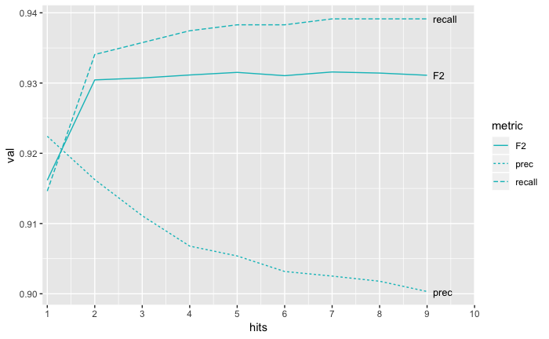
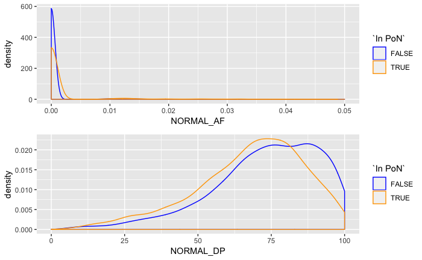

## Panel of normals
To distinguish germline mutations from somatic in tumor, the common practice is to rely a matched normal - a sample from healthy tissue (typically blood) of the same individual. However, often a matched normal is sequenced in a lower depth, which, coupled with an uneven coverage (due to low/high GC or unbalanced structural variants), may lead to coverage gaps and otherwise problematic regions. Sometimes a matched normal may not be available at all (e.g. due to lack of funds or simply sample availability). And even a good matched normal can't always help with sequencing or mapping artifacts in tumor.


_Mollusks have no blood, so if you are treating one, getting a matched blood normal might be a problem._

Therefore, to distinguish somatic mutations, researchers additionally rely on (1) public variant databases and (2) a set of in-house unrelated normal genomes (so called panel of normals) sequenced using similar technology and preparation method. The former helps with missed germline variants common in a population in general, while the panel additionally aids in removing recurrent technical artifacts. 

In UMCCR, we use both method. We rely upon the [gnomAD](https://gnomad.broadinstitute.org) database as a public germline mutation source, by removing matching variants that occur with at least 5% population frequency in any ancestry. And as a source of in-house normals, we constructed a panel of matched normals from tumor/normal experiments done within past 18 months, which comprise 230 blood samples from healthy (non-cancer) unrelated individuals, all sequenced using the same protocol as we apply to tumor tissues. 

When preparing the panel, we tried to answer the following questions:

	* What variant caller should we use to construct the panel? Germline, or somatic in tumor-only setting?
	* How many samples should support the normal variant to keep in the panel?
	* To call a hit, should we compare the exact allele base, or just the position match is enough?
	* Does panel really help most in regions of coverage gaps?
	* How does the panel compare with public databases like gnomAD?

### Normal variant calling
As part of our standard pipeline, we call germline varaints in each normal sample (using GATK-haplotype, Vardict, and Strelka2, as well a 2-of-3 ensemble approach of all). 

Hartwig Medical Foundation in its pipeline [use 2 separate panels of normals](https://www.biorxiv.org/content/biorxiv/early/2018/09/20/415133.full.pdf): one is built from germline calls by GATK-haplotype, another is from Strelka lower frequency calls to tackle Strelka specific artefacts. Broad Institute [recommends](https://gatkforums.broadinstitute.org/gatk/discussion/11053/panel-of-normals-pon) [running](https://software.broadinstitute.org/gatk/documentation/tooldocs/4.beta.1/org_broadinstitute_hellbender_tools_walkers_mutect_CreateSomaticPanelOfNormals.php) Mutect2 somatic caller in tumor-only mode. [Matt Eldridge](/https://bioinformatics-core-shared-training.github.io/cruk-summer-school-2017/Day3/somatic_snv_filtering.html#25/) also called variants with a lower frequency of at least 5%. 

We compared the performance for both germline and tumor-normal approaches on [ICGC MB benchmark](https://www.nature.com/articles/ncomms10001) (T/N calls from medulloblastoma tumor. We tried to maximize the F2 measure (which balances out "recall" - how many true variants we found, and precision - what percent of out yield is actually true).


The best value is achieved with the tumor-only approach to building the panel.

We can also see that the optimal threshold of hits in PoN would be around 5, meaning that we should build the panel of variants supported by at least 5 normal samples:



### Combining and matching
Because variants can be represented differently, especially indels, complex and multiallelic variants, we normalize both normal calls when building the panel, and target tumor calls before searching for hits. [Specifically](https://github.com/umccr/vcf_stuff#vcf-normalisation):

	* Split multiallelic, e.g. A>T,C -> A>T, A>C
	* Decompose multinucleotide variants (MNV), e.g. AG>CT -> A>C, G>T
	* Left-align indels, e.g. CTCC>CCC,C,CCCC -> GCTC>G, CT>C, T>C

When combining normal variants or when matching against tumor, we ignore the actual allele bases for indels, and only compare chromosomal locations. We are doing that based on our benchmarks, but we rationalize it as follows. False positive indels often happen in homopolymers or other repetitive regions, and a variant there represent a different number of repeat units. Thus, it's likely that artifacts may look different in length, but still refer to the same erroneous event. For SNPs however, there may be tendency to certain types of changes, e.g. to be A>C more likely an artifact than A>G, thus the best result is achieved by match the exact allele bases.

Since there is a possibility that even the position of such event may vary, it might make sense to relax the criteria further. [Hartwig Medical Foundation pipeline](https://www.biorxiv.org/content/biorxiv/early/2018/09/20/415133.full.pdf) removes all indels surrounding a PoN indel:

> Regions of complex haplotype alterations are often called as multiple long indels which can make it more difficult to construct an effective PON, and sometimes we find residual artefacts at these locations. Hence we also filter inserts or deletes which are 3 bases or longer where there is a PoN filtered indel of 3 bases or longer within 10 bases in the same sample.  

### Normal coverage gaps
We expect the panel to primarily aid in regions of lower normal coverage, or where there is some non-0 support of a normal variant. To figure this out, we compare distributions of normal depth and normal allele frequency in PoN variants and in non-PoN variants.



We see that the PoN variants corresponds to lower depth and lower AF in normal match, than other variants, which is expected. 

To do this analysis, we don't need a benchmark dataset, thus we can make similar histograms for our research samples to evaluate the PoN in a more realistic setting.  This pattern replicates on most of the patients (first 6 rows):


We also did this exercise to "true" and "called" variants sets of the ICGC MB and COLO829 benchmarks separately, expecting the coverage difference to be less clear for the "true" calls as it should contain fewer artifacts and germline leakage (the remaining rows).

We can also define the "failed" normal locus as the one with coverage below <30x, and with more than 1 read supporting the tumor variant. Then we can calculate the share of called PoN sites falling into those "failed" regions, in the total share of PoN sites in a sample.

We also calculated the same metric for variants filtered with gnomAD, to compare how PoN is helpful versus the population databases. We can see that both PoN and gnomAD mostly filter sites of failed normal coverage, and that also they only partially overlap in their filtering power.


In sum, the panel of normals proves to be useful for filtering of in-house samples, and the result does not diminish in combination with population filtering with gnomAD.

The code for the panel generation is written using Snakemake and stored on the GitHub under https://github.com/umccr/vcf_stuff/tree/master/vcf_stuff/panel_of_normals, and we provide scripts to annotate with the panel at https://github.com/umccr/vcf_stuff#panel-of-normals:

```
pon_anno test.vcf.gz -g GRCh37 -o test.PoN.vcf.gz --panel-of-normals-dir /path/to/the_panel
```


