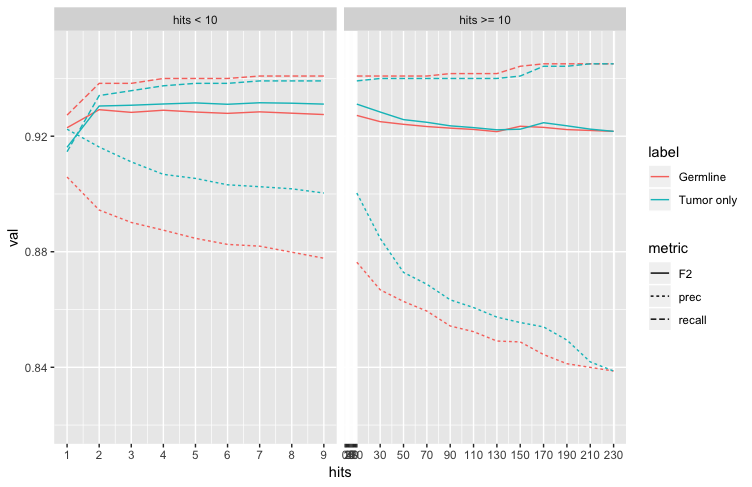
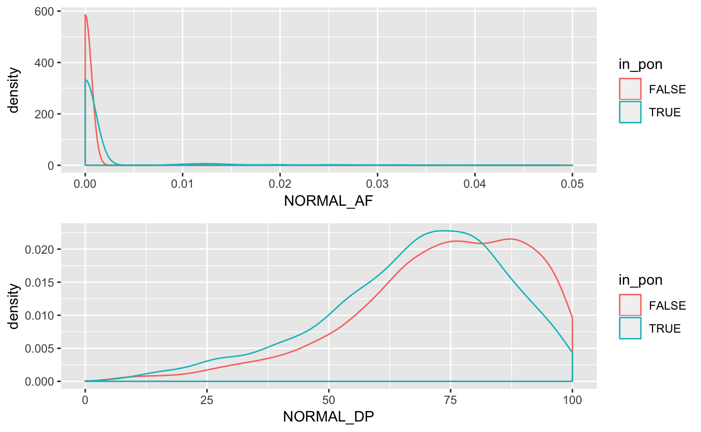
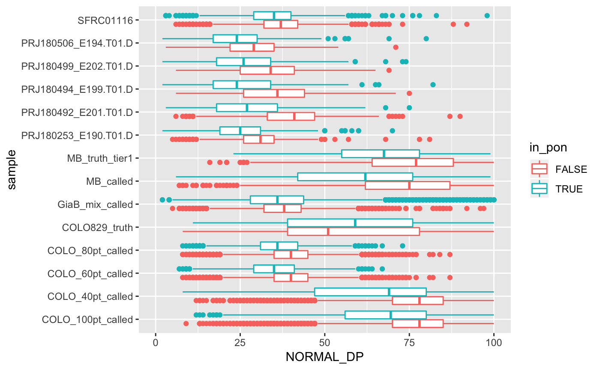
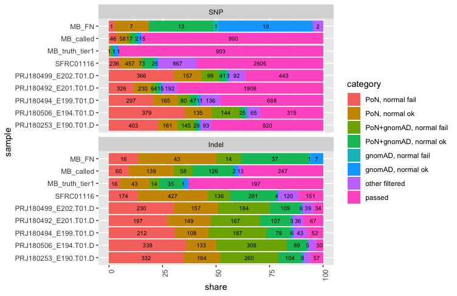

## Panel of normals
To distinguish germline mutations from somatic in tumor, the common practice is to rely a matched normal – a sample from healthy tissue (typically blood) of the same individual. However, often a matched normal is sequenced in a lower depth, which, coupled with an uneven coverage due to low GC or unbalanced structural variants, may lead to coverage gaps and otherwise problematic regions. Sometimes a matched normal may not be available at all (e.g. due to lack of funds or simply sample availability). And even a good matched normal can't always help with sequencing or mapping artifacts in tumor.

Therefore, it makes sense to additionally rely on (1) public mutation databases and (2) a set of in-house unrelated normal genomes (panel of normals) sequenced using the same technology and preparation method. The former helps with missed germline varaints common in a population in general, while the panel additionally aids in removing recurrent technical artifacts. 

In UMCCR, we use both. We rely upon the [gnomAD](https://gnomad.broadinstitute.org) database as a public germline mutation source, by removing matching variants that occur with at least 5% population frequency in any ancestry. And as a source of in-house normals, we constructed a panel of matched normals from tumor/normal experiments done within past 18 months, which comprise 230 blood samples from healthy (non-cancer) unrelated individuals, all sequenced using the same protocol as we apply to our subject tumor samples. 

When preparing the panel, we tried to answer the following questions:
	* How should we call variants in normals: using a germline caller, or a tumor-only somatic caller?
	* How many hits in a panel should be required to remove a variant?
	* To call a hit, should compare the exact allele base, or just the position match is enough?
	* How well the panel really helps in regions of problematic normal coverage?
	* How many unique the panel filters additionally to public databases like gnomAD?

### Normal variant calling
As part of our standard pipeline, we call germline varaints in each normal sample (using GATK-haplotype, Vardict, and Strelka2, as well a 2-of-3 ensemble approach of all). 

Hartwig Medical Foundation in its pipeline [use 2 separate panels of normals](https://www.biorxiv.org/content/biorxiv/early/2018/09/20/415133.full.pdf): one is built from germline calls by GATK-haplotype, another is from Strelka lower frequency calls to tackle Strelka specific artefacts. Broad Institute [recommends](https://gatkforums.broadinstitute.org/gatk/discussion/11053/panel-of-normals-pon) [running](https://software.broadinstitute.org/gatk/documentation/tooldocs/4.beta.1/org_broadinstitute_hellbender_tools_walkers_mutect_CreateSomaticPanelOfNormals.php) Mutect2 somatic caller in tumor-only mode. [Matt Eldridge](/https://bioinformatics-core-shared-training.github.io/cruk-summer-school-2017/Day3/somatic_snv_filtering.html#25/) also called variants with a lower frequency of at least 5%. 

We compared the performance for both germline and tumor-normal approaches on [ICGC MB benchmark](https://www.nature.com/articles/ncomms10001) (T/N calls from medulloblastoma tumor. We tried to maximize the F2 measure (which balances out "recall" - how many true variants we found, and precision - what percent of out yield is actually true). The best value is achieved with the tumor-only approach to building the panel. 

We can also see that the optimal threshold of hits in PoN would be around 5 (meaning, that variants hitting at least 5 samples in the PoN should be removed).

### Normalization and combining
Because variants can be represented differently, we normalize both normal calls and tumor calls before searching for hits. We [split multiallelic, decompose MNV, and left-align indels](https://github.com/umccr/vcf_stuff#vcf-normalisation). Then calls  are merged and annotated with the number of occurrences in the sample set.

### Comparing versus PoN
We determined that the better result is achieved by requiring exact allele base match for SNPs, however taking only location into the account for indels. False positive indels often happen in homopolymers or other repetitive regions, when the mutation is just a different number of repeat units. Thus, it's likely that artefacts may look different in length, however still refer to the same event. Since there is a possibility that even the position of such even may vary, it might even make sense to loosen even further, e.g. by re-quering unexact position match. Hartwig Medical Foundation pipeline removes all indels near one PoN filtered indel:

> Regions of complex haplotype alterations are often called as multiple long indels which can make it more difficult to construct an effective PON, and sometimes we find residual artefacts at these locations. Hence we also filter inserts or deletes which are 3 bases or longer where there is a PoN filtered indel of 3 bases or longer within 10 bases in the same sample.  

However, we did not get to evaluate this approach.

### How well PoN perform on benchmarks?
We evaluated the performance on 3 benchmark datasets with an existing curated "truth" set:
	* `MB` : somatic T/N calls from [medulloblastoma tumor by ICGC](https://www.nature.com/articles/ncomms10001) 
	* `COLO` - somatic T/N calls from [COLO829 cell lines]( https://www.ncbi.nlm.nih.gov/pmc/articles/PMC4837349/, ), re-sequenced in-house in different tumor/normal proportions (40%, 60%, 80%, and 100% purity)
	* `GiaB_mix` -  [emulated somatic dataset]( build from a mixture of NA12878 and NA24385 GiaB datasets  ) from 2 GiaB samples: NA12878 and NA24385.
	
	<F2 measure by PoN treshold plots here) 

### Normal depth
We expect the panel to primarily aid in regions of lower normal coverage, or where there is some non-0 support of a normal variant. To figure this out, we compare distributions of normal depth and normal allele frequency in PoN variants and in non-PoN variants.

We see that the PoN variants corresponds to lower depth and lower AF in normal match, than other variants, which is expected. 

We can also build the same distribution for a broader set of samples, and confirm that the pattern replicates (except for the truth sets, which is expected given their curated nature).

We can also define the "failed" normal coverage as coverage below <30x, with more than 1 read supporting the tumor variant, and calculate percent of bad sites in PoN and for other variants for each sample.

We also calculated the same metric for variants filtered with gnomAD, to compare how PoN is helpful versus the population database. We can see that both PoN and gnomAD mostly filter sites of failed normal coverage, and that also they only partially overlap in their filtering power.

