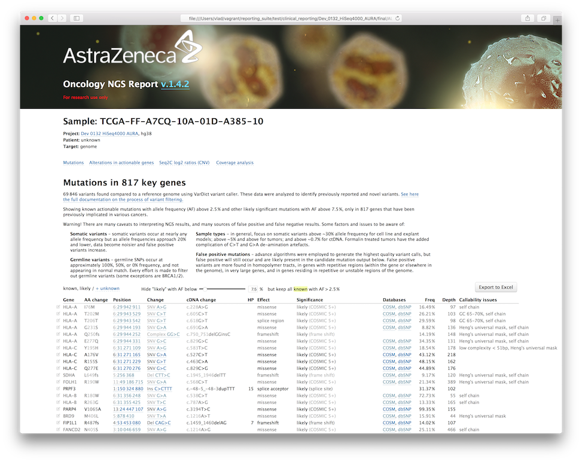

Mutation prioritization
=======================
For VarDict variant calling in bcbio.

### 1. Variant calling
Variants are called by [VarDict](https://github.com/AstraZeneca-NGS/VarDict) ([Lai Z, 2016](http://www.ncbi.nlm.nih.gov/pubmed/27060149)), a versatile variant caller for cancer samples. Here we focus on the following genomic variants:
- Single nucleotide polymorphisms (SNP)
- Multiple nucleotide polymorphisms (MNP)
- Small insertions and deletions
- Complex composite variants
- Somatic and LOH variants (in paired samples analysis)

And the following types of sequencing assays:
- Whole genome (usually 20-60x), calling with 1% allele frequency threshold by default
- Whole exome (usually 100-200x), 1% AF
- Targeted (usually 300-10000x), 0.1% AF

### 2. Variant annotation
Variants in form of VCF file are assumed to be annotated in BCBio-nextgen using [SnpEff](http://snpeff.sourceforge.net/), a tool that predicts effect of variants on gene function in respect to Ensembl gene model. We predict based on canonical (longest) transcripts only, except for the following genes where the longest transcript is substituted with a smaller, but more [cancer-relevant ones](https://github.com/AstraZeneca-NGS/reference_data/blob/master/transcripts/canon_cancer_replacement.txt).

SnpEff assigns:
- gene and transcript IDs
- gene biotype (coding/ncRNA/pseudogene)
- if the variant is in intron/CDS/upstream/downstream/non-coding/splice site
- mutation functional class (silent/missense/nonsense)
- codon change
- amino acid change

Variants are also searched against the following variant databases:
- [COSMIC](http://cancer.sanger.ac.uk/cosmic) &mdash; cancer somatic mutations database, assigns ID and hits count
- [dbSNP](http://www.ncbi.nlm.nih.gov/SNP/) &mdash; assigns rsID and CAF (global allele frequencies in the population)
- [ClinVar](http://www.ncbi.nlm.nih.gov/clinvar/) &mdash; assigns CLNSIG (clinical significance)

### 3. Raw filtering: vardict.txt
The first filtering step is performed using [vcf2txt.pl](https://github.com/AstraZeneca-NGS/VarDict/blob/master/vcf2txt.pl) script from the VarDict package. It consumes an annotated VCF file from VarDict, annotated as described above, and produces `vardict.txt` tab-separated file in a specific format. The program (1) performs hard and soft filtering for low quality variants, (2) assigns _variant class_ ("novelty"), (3) assigns _variant type_ (CNV, MNV, deletion, insertion, complex).

Hard filtering (where the variants are discarded) is performed using the following parameters:
- Locus total depth (&ge; 3x)
- Mean position in reads (&ge; 5)
- Mean base quality phred score (&ge; 25)

Soft filtering (the variants are reported into `vardict.txt` with a reject reason in the `PASS` column) is done based on the following:
- Variant depth (&ge; 3x)
- Mean mapping quality (&ge; 10)

The mutation class (`Var_Class`) is assigned in the following order:
- `COSMIC` &mdash; any mutation found in COSMIC
- `ClnSNP_known` &mdash; any other mutation, labelled significant in ClinVar (3 < `CLNSIG` < 7)
- `dbSNP_del` &mdash; deletion found in dbSNP
- `dbSNP` &mdash; the remaining dbSNP variants
- `Novel` &mdash; all remaining variants

The results of the script are saved under `final/YYYY-MM-DD_projectname/var/vardict.txt`

### 4. Cancer mutation filtering: vardict.PASS.txt
This step consumes sample-level `vardict.txt` files and produces sample-level `vardict.PASS.txt`. It starts with dropping all soft-filtered variants in the previous step, and then removes cancer non-relevant germline mutations and potential artefacts, and classifies the remaining mutations based on their 'actionability' (see the definition in [Carr et al. 2015](http://www.nature.com/nrc/journal/v16/n5/full/nrc.2016.35.html)):
- `known` (highly actionable)
- `likely` (could be actionable, but the evidence is more equivocal or limited)
- `unknown` (remaining high-quality variants with moderate impact)

Also see https://docs.google.com/spreadsheets/d/1JvhO9tEWiSyJPr9-8PWI0-CDT6UrI3D8zR7H0iEePnM/edit?usp=sharing

#### Germline and known common artifacts
Germline SNPs occur at approximately 100%, 50%, or 0% frequency, and every effort is made to filter out germline variants. However, some germline variants are important, especially for tumor suppressor genes like BRCA1 and BRCA2. Germline mutations may be of variants of uncertain significance (VUS), and may be relevant when heterozygous, or only when the other allele is also affected in the tumor, further complicating decisions on actionability. 

##### Heuristics
Currently, the following is done in order to filter germline variants:
- In paired analysis, removing mutations appearing both in tumor and in normal match in similar frequency
- Removing dbSNP common SNPs, reported in ClinVar with `CLNSIG` = `2` (_Benign_) or `3` (_Likely benign_), unless actionable
- Removing variants with high global minor allele frequency (GMAF) in TCGA (> 0.0025), unless actionable
- Cohort filtering: removing `unknown` variants present in &ge; 40% samples and > 5 samples

##### Known common artifacts
Variants are also checked against a list of positions and rules of common germline mutations and artifacts, similarly to actionable lists:
- [filter_common_artifacts.txt](https://github.com/AstraZeneca-NGS/NGS_Reporting/tree/master/variant_filtering/reference_data/hg19/filter_common_artifacts.txt) &mdash; genomic positions and rules. If rule, filter even if actionable. If position, filter if non-actionable and AF < 35%.
- [actionable_hotspot.txt](https://github.com/AstraZeneca-NGS/NGS_Reporting/tree/master/variant_filtering/reference_data/common/actionable_hotspot.txt) &mdash; amino acid positions (removed even if actionable), records only starting with `^`, e.g.: 
  ```
  - ^RBMX G356W 1 Artifact in low complexity
  - ^NQO1 P187S 1 Common germline SNP
  ```
- [filter_common_snp.txt](https://github.com/AstraZeneca-NGS/NGS_Reporting/tree/master/variant_filtering/reference_data/hg19/filter_common_snp.txt) &mdash; genomic positions, removed if not actionable.

##### MSI
Variations of lengths of long homopolymers often cause false positives, and require special treatment. For 1-nucleotide MSI of different lengths, a special AF cut-off is set: HP less than 7 units long, the AF cut-off is set to 3%; 8 - 6%; 9 - 12,5% 10 - 17.5%; 11- 25%; 12 - 30%; 12+ - 35%.

#### Tier 1 &mdash; actionable mutations &mdash; `known`
Variants are checked against a set of rules that defined _actionable_ (known driver) variants. Highly actionable mutations (robust evidence base and/or strong scientific rationale linking the mutation with probable sensitization to drug, and/or high likelihood of response in proposed trial and disease setting) are reported as `known`.

The rules may specify any specific descriptive feature of a variant, like gene, exon, genomic or protein position and change, genomic or protein region, type of change: deletion, frameshift deletion, insertion, frameshift insertion, indel, etc.

Amino acid changes, exons and codon numbers that define actionable somatic and germline changes:
- [actionable_hotspot.txt](
https://github.com/AstraZeneca-NGS/NGS_Reporting/tree/master/variant_filtering/reference_data/common/actionable_hotspot.txt) &mdash; everything until records starting with `^`
- [specific_mutations.tsv](https://github.com/AstraZeneca-NGS/NGS_Reporting/blob/master/variant_filtering/reference_data/common/specific_mutations.tsv) &mdash; mutations under `TIER1` column
- [TP53 rules](https://github.com/AstraZeneca-NGS/NGS_Reporting/blob/master/variant_filtering/reference_data/common/rules)

Genomic positions that define actionable germline and somatic variants:
- [actionable.txt](https://github.com/AstraZeneca-NGS/NGS_Reporting/tree/master/variant_filtering/reference_data/hg19/actionable.txt)

Finally, variants found in ClinVar with a high significance (`CLNSIG` = `4` &mdash; _Likely pathogenic_ or `5` &mdash; _Pathogenic_) are reported as `known`.

#### Tier 2 &mdash; `likely`
This class of mutations could be actionable, but no strong evidence supporting it observed. Reported as `likely`.

- High-impact somatic variants:
  - Frameshift
  - Stop gained
  - Start loss
  - Splice site mutation
  - LOF in a tumor suppressor
- Deletion reported in dbSNP (`Var_Class` = `dbSNP_del`)
- COSMIC hotspots (only if at least 5 samples reported) (`Var_Class` = `COSMIC`)
- [Compendia hotspots](https://github.com/AstraZeneca-NGS/NGS_Reporting/tree/master/variant_filtering/reference_data/hg19/Compendia.MS7.Hotspot.txt) (based on TCGA database)
- Mutations under `TIER2` column in [specific_mutations.tsv](https://github.com/AstraZeneca-NGS/NGS_Reporting/tree/master/variant_filtering/reference_data/common/specific_mutations.tsv)

#### Tier 3 &mdash; `unknown`
Evidence insufficient to classify as actionable or justify using in patient treatment decision at this time. 
- Moderate impact mutation (missense, inframe indels)
- Reported in ClinVar with `CLNSIG` = `0` (_Uncertain significance_) or `255` (_other_)
- Any silent unknown mutations are reported as `silent` in the `Reason` column (and reported for driver analysis that compares mutations with silent background)

#### Allele frequency thresholds
The AF thresholds are set:
- WGS: 5% for actionable mutations, 7.5% for the rest mutations
- Exome: 2.5% for actionable mutations, 7.5% for the rest mutations
- Deep sequencing: 0.2% for for actionable mutations, 0.5% for the rest mutations, 

For germline actionable mutations, the AF threshold is set to 15%.

Thresholds are driven partly by confidence in differentiating real tumor mutations at low AF from artefacts in tumor sequencing data, but also by an assumption that very-low-frequency events may have little or no relevance to tumour progression and treatment response.

When interpreting results, focus on somatic variants above ~30% allele frequency for cell line and explant models, above ~5% and above for tumors, and above ~0.7% for ctDNA.

#### Non-callable genes and regions

An extended list of genes, exons, and regions is used to de-prioritize mutations in the reports, but does not affect mutation status.

##### Genes

* Frequently mutated genes (FLAGS) - AF <1% functional variants from dbSNP and ESP6500 (Casper et al, 2014) - 100 genes

* The list of protein-coding genes associated with human diseases from Online Mendelian Inheritance in Man (Hamosh, 2005) - 3099 genes

* The list of protein-coding genes with damaging mutations (<1% allelic frequency) from Human Gene Mutation Database (Stenson, 2014) - 2691 genes

* A list of novel genes implicated in human disorders based on WES studies (Boycott, 2013) - 300 genes

* MutSigSV (Lawrence et al, 2013) analysis of TCGA tumor types (genes that mutated more often than expected by chance) + 39 genes

* Highly polymorphic genes: HLA complex (in particular those in the region but not clearly involved in MHC/HLA/IO), olfactory receptor genes, given their high polymorphism and alternate haplotype structure

* Some large gene families

Mutations belonging to any gene from the following blacklist are always removed:
```
RBMX
CRIPAK
RBMX2
RBMXL1
RBMXL3
EPPK1 after 2215aa
TYRO3
OR#X#   # olfactory genes
HLA-*   # unless specified to keep them explicitly
```

Full list of soft filtered genes is available [here](https://docs.google.com/spreadsheets/d/1Uc-v_7WlIFD2DpuxflpxS2kCLXOrFt2NGSwh1oVq9TQ/edit?usp=sharing).

##### Regions

* Low GC (0-30%) and high GC (65-100%)

* Low complexity: homopolymers, STRs, VNTRs and other repetitive sequences - compiled from TRDB (Gelfand, 2007). Small regions of cancer genes with recurrent mutations are often due to low complexity or short interstitial repeats where one copy is deleted and picked up by Vardict as a complex mutation. Also, homopolymer mononucleotide repeats less than 8 can result in a mutation at a lower frequency.

  * UCSC provides masker-tracks of mappability, self chains aligning, known repeats.

  * Homopolymers can be masked using `seqtk hrun` applied to the genome sequence.

  * Heng Li pre-prepared a mask combined of: compositional mask (low-complexity by mDUST and from UCSC repeatMasker plus flanking regions)  and structural mask (HWE+depth mask from 1kg plus flanking regions).

#### Cohort filtering
If the samples are not homogeneous, but come from single sequencer's run, we expect recurring variants to be caused by sequencing artefacts. Also, too common mutations are expected to be germline. For all non-known and non-actionable variants, we calculate the number and the percentage of samples harbouring this variant. If it's more than 40% of all samples and at the same time at least 5 samples, such variants are filtered out. Cohort filtering is done on the stage of merging all sample-level `vardict.PASS.txt` into the project level `vardict.PASS.txt` located in `final/<datestamp>` directory.

### Output format
`vardict.PASS.txt` is a tab-separated format that contains one record per protein change (e.g. several lines per genomic change can occur in case of overlapping genes or isoforms, although usually only one transcript per gene is analysed). 
```
Sample              TCGA-FF-A7CQ-10A-01D-A385-10  
Chr                 chr1                          
Start               16757321                      
ID                  rs11260920;COSM4590992        IDs in dbSNP and COSMIC databases
Ref                 G                             
Alt                 A                             
Type                stop_gained                   Effect reported by SnpEff
Effect              HIGH                          Effect impact reported by SnpEff
Functional_Class    stop_gained                   Same as Type
Codon_Change        c.1981C>T                     
Amino_Acid_Change   R661*                         
cDNA_Change         c.1981C>T                     
Amino_Acid_Length   689                           
Gene                MST1L                         Reported by SnpEff
Transcript_bioType  protein_coding                Reported by SnpEff
Gene_Coding         transcript                    Reported by SnpEff
Transcript          NM_001271733.1                Reported by SnpEff
Exon                15/15                         Exome number / total exones, reported by SnpEff
COSMIC_GENE                                       COSMIC uses different gene model rather than SnpEFF (Ensembl-based), 
                                                  and it also annotates based on genomic position without taking 
                                                  transcript and gene into consideration, thus we allow mutations only  
                                                  when COSMIC_GENE equals GENE
COSMIC_CDS_Change   c.1981C>T                       
COSMIC_AA_Change    p.R661*                        
COSMIC_Cnt          11                            Number of samples in COSMIC database sharing this mutation
End                                               
Depth               110                           Total depth at locus
AlleleFreq          0.1                           Allele frequency
Bias                2:2                           Strand bias
Pmean               18.1                          Mean position in reads
Pstd                1                             Position STD in reads
Qual                32.6                          Mean quality score in reads
Qstd                1                             Mean quality score in reads
SBF                 0.0156                        Strand Bias Fisher p-value
GMAF                                              Global minor allele frequency based on 1000Genomes
VD                  11                            Variant depth
RD                  99                            Reference forward, reverse reads
CLNSIG                                            Clinical significance according to ClinVar (0 - uncertain, 1 - not provided, 2 - benign, 3 - likely benign, 4 - likely pathogenic, 5 - pathogenic, 6 - drug response, 7 - histocompatibility, 255 - other)
CLN_GENE                                          Gene ClinVar (the same situation as with COSMIC, see COSMIC_GENE)
ODDRATIO            5.747                         Strand Bias Oddratio
HIAF                0.1048                        Allele frequency using only high quality bases
MQ                  13                            Mean Mapping Quality
SN                  22                            Signal to noise ratio
AdjAF               2.4                           
NM                  0                             Mean mismatches in reads
Shift3              2                             
MSI                                               Homopolymer length
dbSNPBuildID        120                           Version of dbSNP build where that rsID first introduced
GT                  0/1                           Genotype
DupRate                                           
SplitReads                                        
SpanPairs                                        
N_samples           1                             Number of samples in a cohort
N_Var               1                             Number of samples in a cohort sharing this mutations
Pcnt_sample         1.000                         Percent of samples in a cohort sharing this mutations
Ave_AF              0.100                         Average AF of variant in cohort 
PASS                TRUE                          
Var_Type            SNV                        
Var_Class           COSMIC                              
LOF                 YES                           Loss of function as reported by SnpEff (http://www.sciencemag.org/content/335/6070/823.abstract)
Significance        likely                        Mutation tier
Reason              COSMIC_5+, stop_gained        Reason to put this mutation into this tier
Incidentalome       low complexity gene           If mutation overlaps any region with poor callability
```

### 5. Reporting
Mutations are reported into NGS Oncology reports. For WES and WGS projects, the reports shows only mutations in 817 key cancer genes. If it's a targeted panel (the total number of genes is less than 2000), the target genes are used instead.
 

 
By default, only `known` and `likely` changes are displayed. Clicking the "+ unknown" link will add `unknown` changes into the table too. 

The changes overlapping regions with poor callability are faded.
